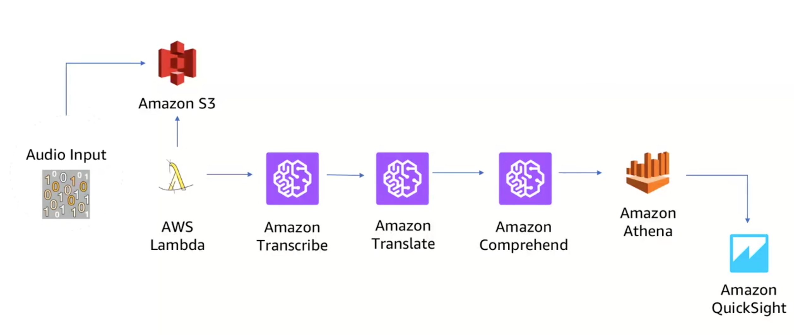
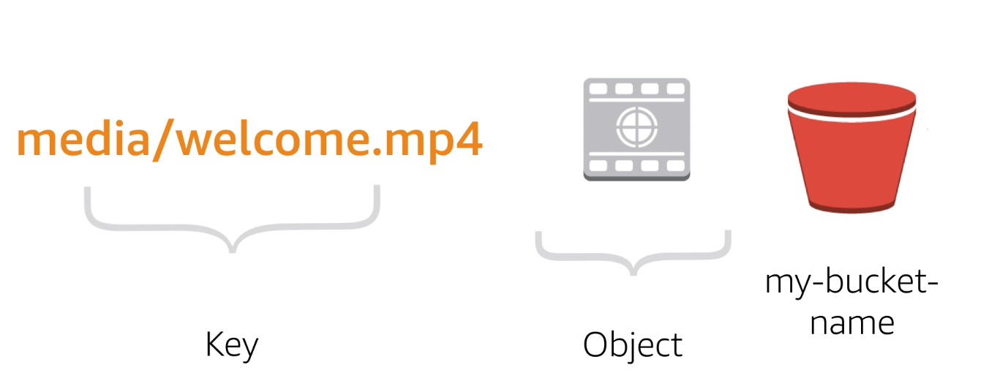
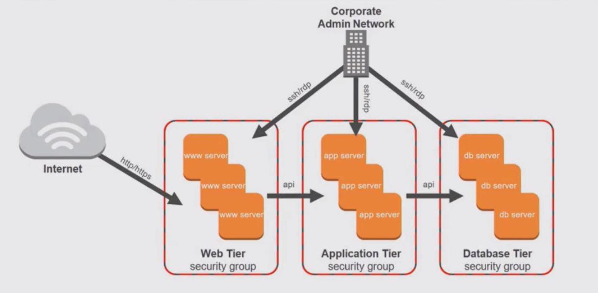
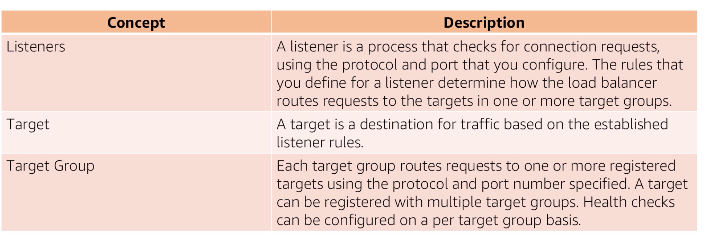
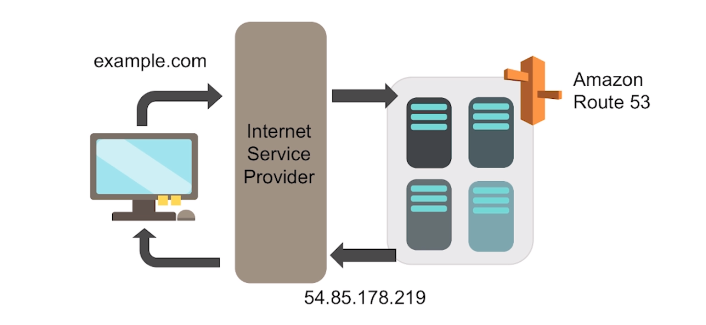
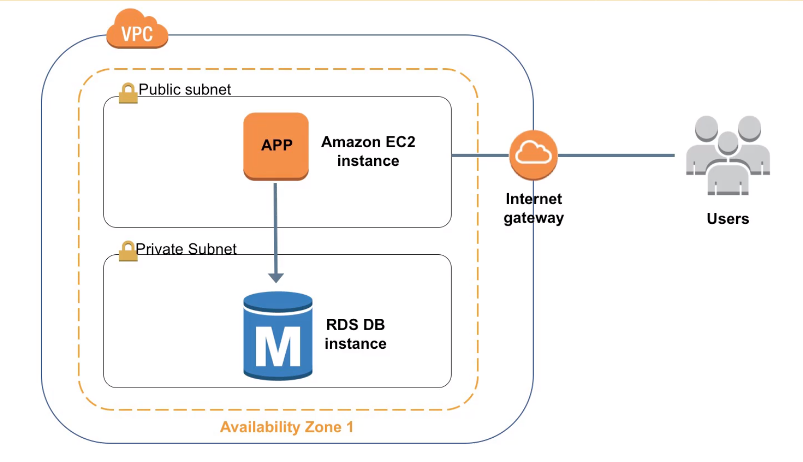
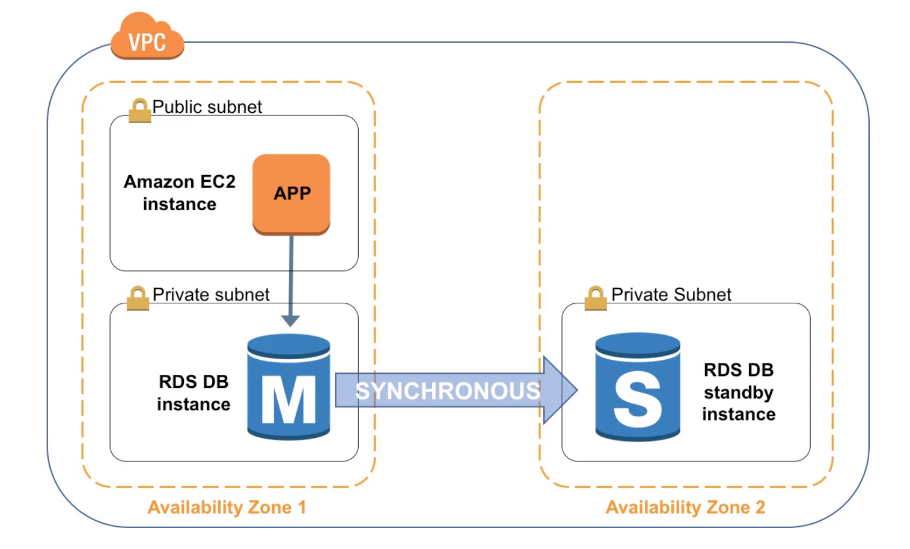
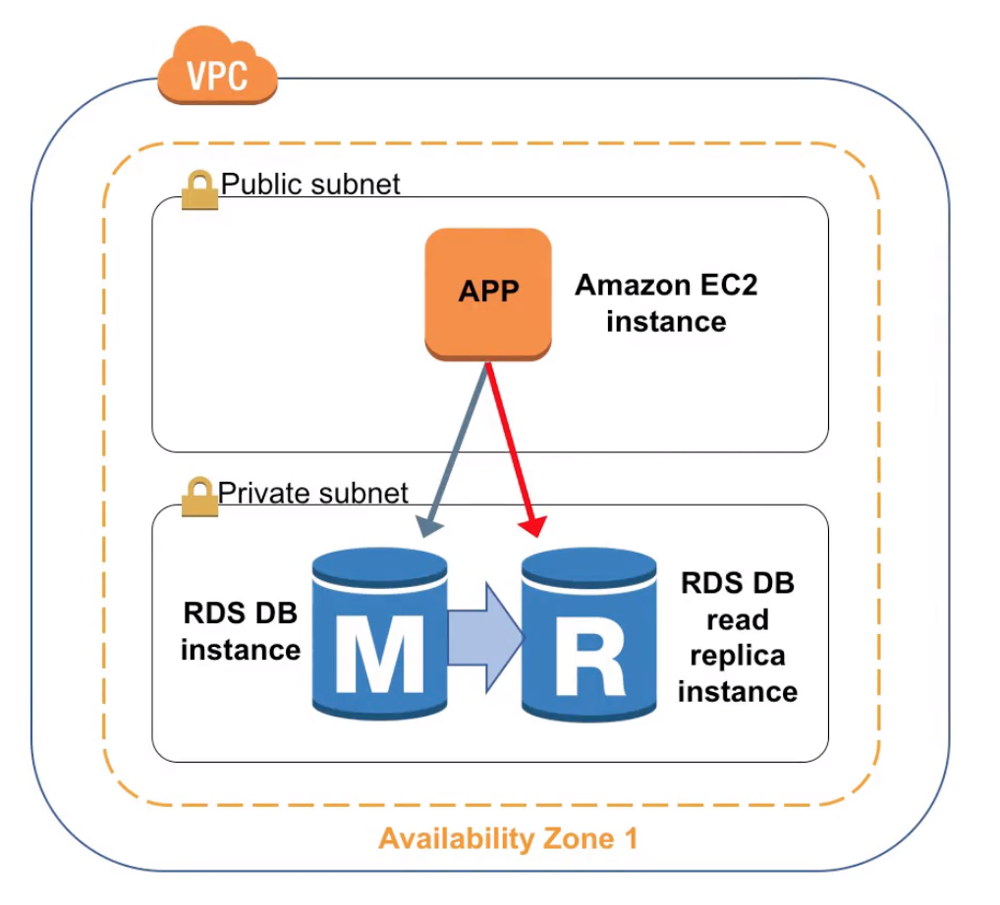
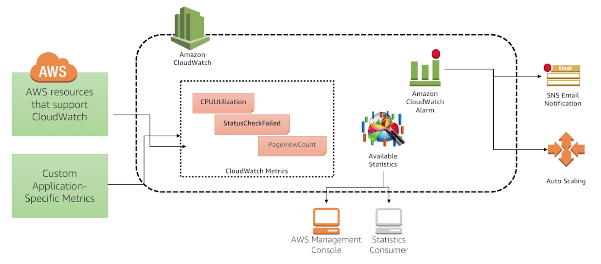
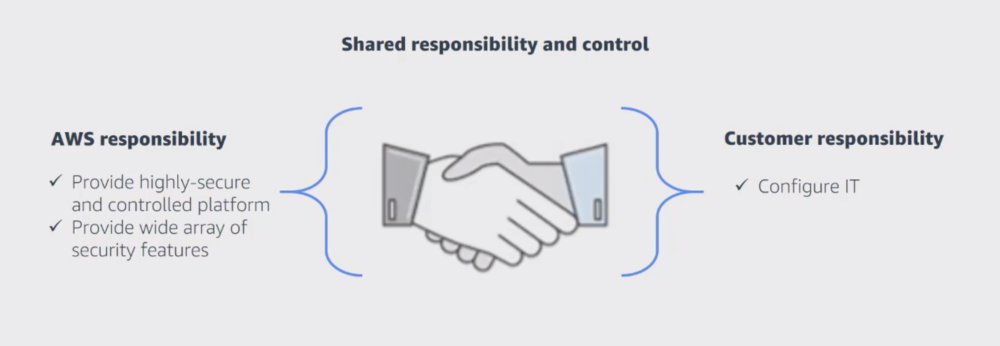

### AWS Machine Learning Stack
#### Four layers
* Service
  - Amazon Polly: convert text to speech; 25 languages; 52 voices; real-time solution.
  - Amazon Lex: text/voice comprehension and response (English, Spanish); build chatbot, detect intent.
  - Amazon Rekognition: picture & video content; object, face, activity, adult content, OCR.
  - Amazon Transcribe: speech to text for call center, video subtitle, meeting note.
  - Amazon Translate: real-time or batch translation.
  - Amazon Comprehend: entity, key phrase, sentiment, insight and relationship; use case: semantic search makes search smarter.



* Platform
  - SageMaker (flagship for enterprise ML):
    * Support data streaming.
    * Pre-built notebook; high performance algorithm.
    * one-click training, hypyerparameter tuning.
    * One-click deploy, hosting with auto-scaling.
  - AWS Deeplense: HD video camera with built-in CV model.
    * e.g. open garage door when seeing a car
    * Alert owner when dog sits on couch.

* Framework & Interface
  - Caffe2
  - CNTK: cognitive toolkit
  - Apache MXNet
  - PyTorch
  - TensorFlow
  - Torch
  - Keras
  - Gluon: high level DL interface.
  - Apache MXNet

* Infrastructure
  - GPU instances, CPU, IoT/Edge
  - AWS Greengrass: IoT real-time; operate offline; quick response (emergency stopping, medical call); privacy compliance.

#### Some Stats
* Data science spend 80% of time preparing data.
  - Explore data: AWS Glue, Athena
* 50% of models never get implemented.

> The value of data science relies upon operationalizing models within business applications and processes.

___
### Machine Learning for Business Challenges
Use case at Amazon
* What products to recommend at detail page.
* How many units of ASIN will be purchased next month.
* What is customer asking Alexa for.
* Is this a stolen credit card.

When to apply ML:
* When logic is not difficult to program.
* When manual process is not cost effective.
* Lots of data.
* Formalize as regression/classification tasks.

___
### AWS Core Services
#### Interface
* AWS Management Counsel
* AWS Command Line Interface
* AWS SDKs
  - Languages: JS, Python, Node, C++, PHP, Java, Go, .Net, Node.js
  - Incorporate into code.

___
#### EC2: Elastic Compute Cloud
1. Choose AMI (Amazon machine image, software selection)
2. Choose instance type (hardware selection)
3. Instance detail: number of instance, network
4. Add storage
5. Add tags
6. Security groups: firewall rule
* Create a key pair to connect over SSH.

___
#### EBS: Elastic Block Store
* Can choose HDD, SSD.
* Durable & available: duplicated automatically in same zone.
* Use **snapshot** for backup.
* Can create a volume and attach to an existing instance (same zone required)

Set up volume:
1. Choose zone.
2. Choose volume type (magnetic, SSD); size
3. Create volume and get a *Volume ID*
* Under *Volume*, click *Actions*, *Attache Volume*. Specify EC2 instance, device `dev/sdb`

```bash
# check blocks attached
lsblk

# create a file system in the volume
# xvdb is the name shown in lsblk
sudo mke2fs /dev/xvdb

# mount volume (linux)
sudo mount /dev/svdb /mnt

cd /mnt

# unmount
sudo unmount /mnt
```

Detach volume. State changes `in-use` to `available`

___
#### S3: Simple Storage Service
* Fully managed storage service.
  - Fault tolerant; replicated.
* Virtually unlimited number of objects.
* Access & retrieve data any time, from anywhere.
  - virtual private cloud end-point.
  - console, CLI, SDKs, HTTP, HTTPS
  - bucket name must be globally unique, DNS complaint, URL-safe.t
* Rich security control.
* Object is stored as key-value pair. Key resembles file path.



1. Create bucket: name, region.
2. Upload object from local machine (file)

```bash
# upload single file
aws s3 cp demo.txt s3://bucket-name-1/hello.txt

# sync folder
aws s3 sync src_dir s3://bucket-name-1/dst_dir
```

3. Log into EC2, which must have access to the S3 bucket.

```bash
# check content
aws s3 ls s3://bucket-name-1 --recursive

# copy file to EC2
aws s3 cp s3://bucket-name-1/hello.txt .

# sync folder
aws s3 sync s3://bucket-name-1/dst_dir ec2_dir
```

___
#### AWS Global Infrastructure
Region
* Host >= 2 availability zones.
* Organizing level for AWS services.
* Optimize for latency, cost, regulatory compliance.
* Resource in one region is not automatically replicated in another.
* All resources are not available in every region.

availability zone
* Collection of data center in a region.
* Connected via fast low-latency network.
* Independent from each other (protected from failure).

Edge Location
* CDN (Amazon Cloud Front).
* Request for content is routed to nearest edge location.

___
#### Virtual Private Cloud (VPC)
* Same concepts as on-premise networking.
* Private network in the AWS Cloud.
* What to expose to the internet, and what to remain private in VPC.
* Divide VPC into subnets
* Route tables
  - Control traffic going out of the subnets
* Internet gateway (IGW)
  - Allow access to the internet from Amazon VPC.
* NAT gateway
  - Allow private subnet resources to access internet.
* Network access control list (NACL)
  - Control access to subnets; stateless.

___
#### Security Groups
* Default: all inbound denied, outbound allowed;
* Best practice: minimum allowed
* `0.0.0.0/0` means all IP address,




___
### Integrated Services
#### Application Load Balancer


___
#### Auto-scaling
Add or remove instances.
Launch configuration
* AMI, instance group, security group, roles
Auto scaling group
* VPC, subnets, load balancer, max/min instances, desired capacity
Auto scaling policy
* Scheduled time; on-demand; scale-out scale-in.

___
#### Route 53
Translate domain name to IP address.
1. Create hosted zone.
2. Add record set `www`
3. End point: EC2, load balancer, cloud front distribution etc.
* Compliant with IPv4, IPv6



___
#### Relational Database Service (RDS)
* Building block: DB instance.
* DB engine: MySQL, Amazon Aurora, MS SQL, PostgreSQL, MariaDB, Oracle.
* DB in *private subnet*, only accessibly from EC2.
  - private subnet associated with a single availability zone.
* Automatically copied in another availability zone (**standby instance**)
  - synchronized.
  - Failover and automatically replaced




* Read replica
  - async, needs manual promotion to master
  - Reroute read query to read replica



___
#### AWS Lambda
* Fully managed server-less compute.
* Event-driven execution.
* Sub-second metering.
* Constraint:
  - 5 minute
  - request, response payload 6MB
  - memory 512 MB
* Trigger:
  - CloudWatch event
* Use case: automatic backup, process upload to S3, event driven log analysis, transformation; IoT; ELT; validate user input.


___
#### Elastic Beanstalk
Platform as a service; get application onto cloud as quickly as possible.

___
#### Simple Notification Service
* Fully managed pub/sub messaging and mobile communication services.
* Coordinate the delivery of messages to subscribing endpoints and clients.
* Edit topic policy: who can publish and subscribe
* End point: HTTP, Email, Lambda

___
#### CloudWatch
* Real-time monitoring: CPU, I/O, status check, custom check; alarm; automatically react.
* Respond to state change.
* Trigger AWS to update DNS entry when new EC2 boosts up
* Components:
  - Metric: can be customized
  - Alarm: watches a single metric; invoke one or more actions
    - stop, terminate, reboot, recover, auto-scale, SNS
  - Event: **near real time**;
  - Log: EC2 instances real-time
  - Dashboard



___
#### CloudFront: CDN
Cache content at edge location near users. Deliver content faster.
* Types: Web, RTMB (video streaming).
* Origin: S3 bucket, IP address of webserver, load balancer etc.
* Use case
  - static asset caching
  - live & on-demand video streaming
  - security, DDOS protection
  - dynamic & customized content
  - API acceleration
  - software distribution

___
#### CloudFormation
Simplify the task of repeatedly and predictably creating groups of related resources that power your applications.
* Automate provisioning of AWS resource.
* Template file + CloudFormation = Stack of AWS resources
* Template: yaml or JSON, describe the resource
  - contain same information as needed in AWS console manual deployment.
  - Don't need to be in same order.
  - Use `depends-on` attribute to build dependencies.
  - Automatically saved to a S3 bucket.
* Stack: Unit of deployment.
* Permission: whoever calling template must have permission to operate all resources specified in template.


___
### Architecture Design Principles
- Security:
  * Five areas: IAM, detective control, Infrastructure protection, data protection, incident response.
  * Five principles: all layers, enable traceability (logging, auditing), least privilege, securing your system , automate.
- Reliability:
  * Recover from issue/failures
  * Three area: foundation; change management; failure management.
  * anticipate, respond, prevent failures
  * test recovery procedure.
  * automatically recovery.
  * scale horizontally (increase aggregate system availability).
- Performance efficiency
  * select customizable solutions.
  * continually innovate. Review newly released products.
  * principles:
    - democratize advanced tech
    - go global
    - use server-less architecture
    - experiment more often
- Cost efficiency
  - Choose cheap resource
  - elastic scaling to match demand with supply
  - increase expenditure awareness
  - optimize over time
  - principles:
    * adopt a consumption model
    * measure overall efficiency
    * stop investing on data center
    * analyze and attribute expenditure (Grocery)
    * Use managed service (e.g. server-less)
- operational excellence
  * manage and automate changes
  * responding to events
  * define standards

___
#### Fault Tolerance & High Availability
* Built-in redundancy of application components.
* Minimize downtime & human intervention.
  - Elastic load balancer
    * distribute incoming load
    * send metrics to CloudFront
    * trigger & notify
  - Elastic IP address
    * greater fault tolerance
    * mask failures
  - Route 53
    * simple routing;
    * latency-based routing;
    * health checks;
    * DNS failure;
    * geo-location routing;
  - Auto-scaling
    * terminate or start instances
    * modify capacity
    * create new resources on demand
  - CloudWatch
    * distributed statistics gathering system.
    * used with auto-scaling
* Fault tolerance tools:
  - Simple Queue Service: distributed messaging system
  - Simple Storage Service: redundancy across devices and facilities in a region.
  - Relational Database System

___
### Security
Shared responsibility model
* Some module is managed by AWS, some managed by You

| Layer           | Note           |
| :-------------- | :------------- |
| User Data       | User access    |
| Application     | Choose your software (above which AWS has zero visibility) |
| Guest OS        | Choose Linux, windows on EC2 |
| Hypervisor      | Zen-based |
| Network         | AWS-managed |
| Physical        | AWS managed |

* User: a permanent main operator (human, machine)
  - credentials are permanent until forced rotation
* Group: a collection of user
* Role: an authentication method
  - operator (human, machine)
  - credentials are temporary
* policy documents: attached to user, group, or role (a JSON document)

Sample workflow: put a object in S3
1. an operator makes API call, name object, present credential (username, password, secret key)
2. **authentication**: Validate authorization credentials. Is it a user, or role, or group.
3. **authorization**: Take policy documents associated with the operator. Is action sanctioned by policy doc?
  - Policy may have explicit deny, that overwrites any allow statement.
  - If hacker gets password, can still cut off authorization.

#### Amazon Inspector
Assess application for vulnerabilities and deviation from best practices.
* Integrate security into DevOps
* Increase development agility.
* Leverage AWS security expertise.
* Streamline security compliance.
* Enforce security standards.
* Identify application security issues.
* Accessible via Amazon Inspector Console, CLI, API, SDK

#### AWS Shield
A managed, DDoS protection service that safeguards applications running on AWS (ELB, Route 53, CloudFront).
* DoS vs DDoS:
  - DoS: flooding with network traffic, consume bandwidth.
  - Distributed DoS:
    * Infrastructure layer: use multiple sources (botnet)
    * Application layer attack: misleads web app to connect to other site. Use *web application firewall* to block requests before reaching server.
Two protection options:
* AWS Shield Standard: free; always-on; self-service; any AWS resource & region.
* AWS Shield Advanced: 24/7 access to DDoS response team.

#### Security Compliance
Measured by customer success. Three components:
* Risk management
* Control environment
* Information security



Workflow
1. Review trusted information and document compliance requirement.
2. Design and implement control objectives that meet compliance requirement.
3. Identify and document controls owned by outside parties.
4. Verify all control objectives are met and all key controls are designed and operating effectively.

___
### Pricing
* Pay for computing, storage, outbound data (tiered)
  - No pay for inbound data
* Cost factor
  * Server clock time
  * Machine configuration
  * Deployment type: single/multiple availability zones
Types of instances
  - on-demand instance, pay by hour
  - reserved instance, discount with low up-front charge
  - spot instance: bid for unused capacity
**Trusted Advisor**: keep best practices in
  * cost optimization
  * performance
  * security
  * fault tolerance
