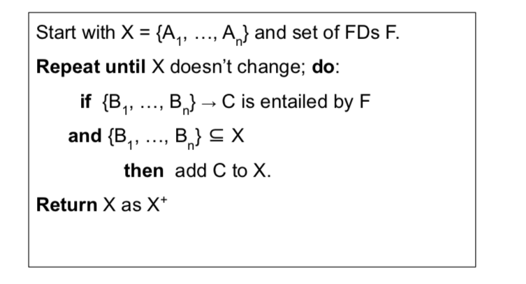
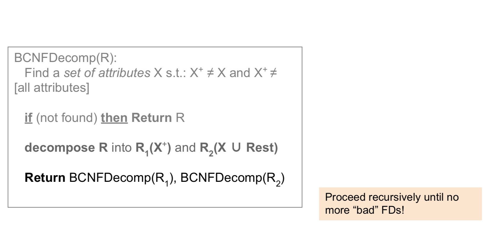
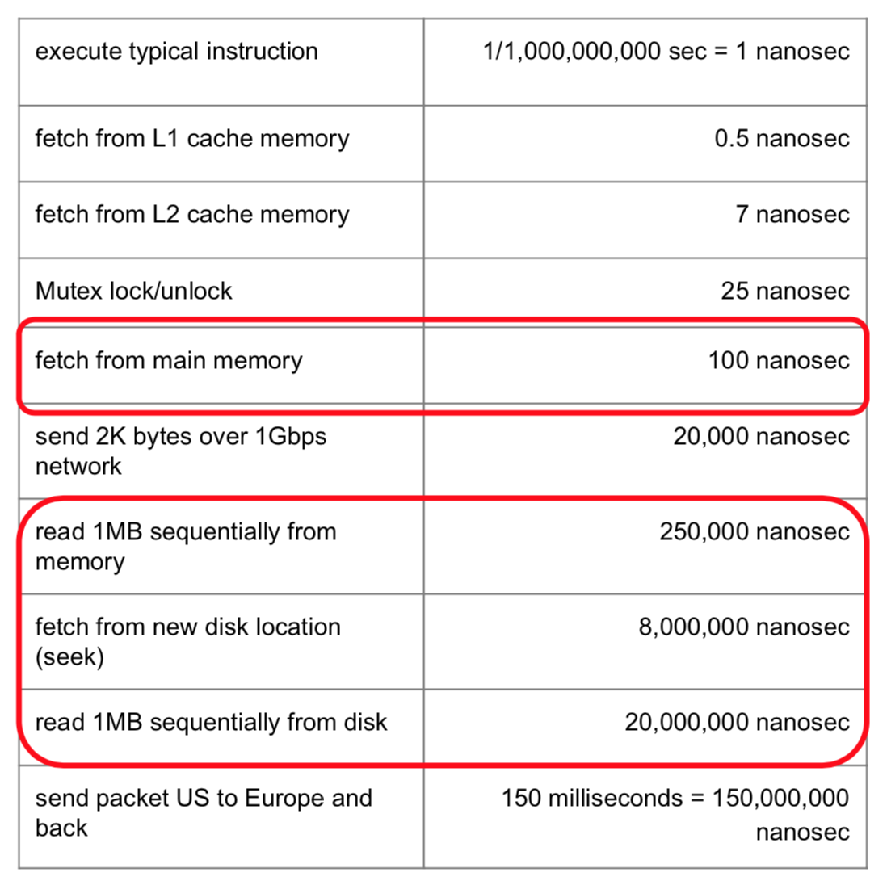
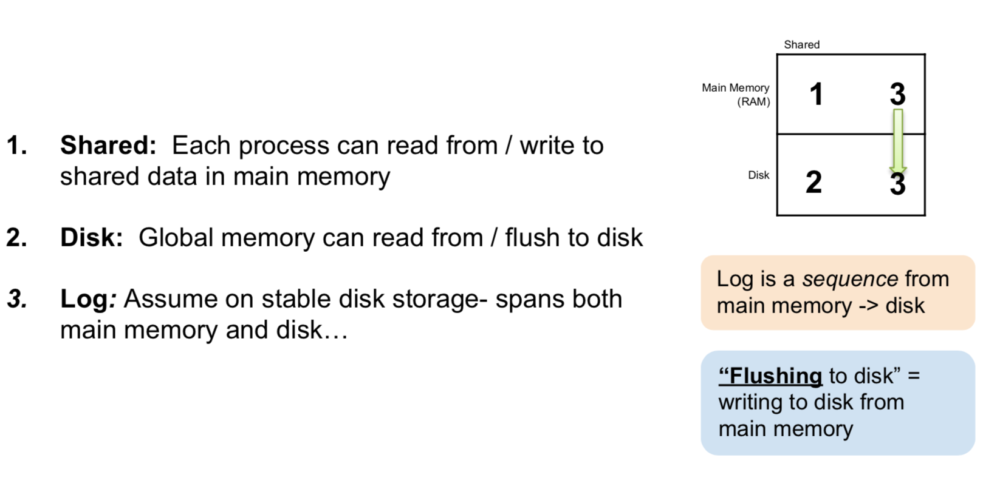

### Lecture 5-6: Design Theory
#### First-Normal Form: completely flat
  - Types must all be atomic!
  - Cannot have a cell storing `{cs145, cs229}`
  - Split into tables to avoid anomalies.
    * redundancy
    * update, delete, insert anomalies.

#### Functional dependencies
* Like a hash function.
* One direction does not imply the reverse. (e.g. hash collision).
* Armstrong rules on closure operation
  - Split/combine (right hand side only!)
  - reduction (trivial)
  - transitivity




#### Key, Superkey, Closure
* Superkey (set) functionally determines every other attribute.
  - Superkey X+ includes all columns.
* Key is a minimum superkey.

How to infer all FDs:
1. Find X+ for every subset X of columns.
2. Enumerate all FD which do not include trivial reduction.
3. If X+ is all columns, X+ is superkey. The smallest X+ is key.

#### Decomposition
* Lossless Decomposition: joining decomposed table reconstructs original table.
* *Normalized*: keep decomposing table (lossless).

#### Boyce-Codd Normalized Form (BCNF)
Good FD: superkey X determines everything else. If not:
* X determines some of the columns.
* Other columns can be duplicated.
* redundancy leads to anomaly.  
* The bad FD is not in BCNF.
* Break bad FD into two tables.
  - recurse until there is no bad FD in each table.
  - decomposition may not be unique.
* **3NF**: more relaxed, can be BCNF or part of any key.




#### Multi-valued Dependencies (MVD)
* Conditionally independent columns cannot be expressed by FD
* Simple example: cross product of two columns.

___
### Lecture 7: Transaction
RAM vs Disk:
* Fast but limited;
* Expensive;
* Volatile (temporary);

Latency number every engineer should know.


Transactions are a programming abstraction that enables the DBMS to handle *recovery* and *concurrency* for users.

A transaction (“TXN”) is a sequence of one or more operations (reads or writes) which reflects a single real-world transition.
*  In the real world, a TXN either happened completely or not at all

Motivation:
* Recovery & durability: in case of crash, aborts, system shutdowns
* Concurrency: parallelizing TXNs without creating anomalies
  - throughput (# transactions); latency (time for single transition)




```SQL
START TRANSACTION;

ROLLBACK;

COMMIT;
```

ACID Properties of transaction:
* Atomicity: State shows either all the effects of txn, or none of them
  - **logging**
* Consistency: Txn moves from a state where integrity holds, to another where integrity holds
  - user-defined constraints hold (e.g. balance can't be negative)
* Isolation: Effect of txns is the same as txns running one after another
  - during concurrent queries, should not be able to observe changes from other transactions during the run
  - **locking**
* Durability: Once a txn has committed, its effects remain in the database
  - effect persists after whole program terminates, power failure, crash etc.
  - does not guard against media failure (earthquake)

> ACID is an extremely important & successful paradigm, but still debated!

#### Logging - Atomicity & Durability
* Is a list of modifications
* Log is duplexed and archived on stable storage.
* Record UNDO information for every update.
* The log consists of an *ordered list of actions*
  - `<XID, location, old data, new data>`
  - changes are continuously logged during a transaction.

Write to disk: **Write Ahead Logging (WAL)**
* Commit: after we’ve written log to disk but before we’ve written data to disk
* If crash, not durable, because update has not been written to disk.
* When restart, roll back all logged action, if any action remained uncommitted. Notify developers.

> Upon restart, that program might need to know whether the operation it was performing succeeded, succeeded partially, or failed. If a write-ahead log is used, the program can check this log and compare what it was supposed to be doing when it unexpectedly lost power to what was actually done. On the basis of this comparison, the program could decide to undo what it had started, complete what it had started, or keep things as they are. [wikipedia](https://en.wikipedia.org/wiki/Write-ahead_logging)

Alternative: Cluster Model
* Duplicated across N machines.
* RAM do not fail at the same time.
* **faster** to write on a different machines RAM.
* Power on different racks are uncorrelated by design.
* Still keeping a log.

#### Cuncurrency
* The DBMS has freedom to interleave TXNs
* However, it must pick an interleaving or schedule such that isolation and consistency are maintained
* A **serial schedule** is one that does not interleave the actions of different transactions
* A and B are **equivalent schedules** if, for any database state, the effect on DB of executing A is identical to the effect of executing B
* A **serializable schedule** is a schedule that is equivalent to some serial execution of the transactions.

Classic anomalies / conflict
* Unrepeatable read (RW conflict): another transaction completes between two reads of the same transaction.
* Dirty read (WR conflict): read uncommitted data (aborted transaction)
* Inconsistent read (WR conflict): read from partial commit
* partially lost update (WW conflict)
* cannot have RR conflict.


* Conflict is a property of transaction.
  - Two actions conflict if they are part of different TXNs, involve the same variable, and at least one of them is a write
* Anomaly is a property of schedule.

Two schedules are conflict equivalent if:
* They involve the same actions of the same TXNs
* Every pair of conflicting actions of two TXNs are ordered in the same way

Schedule S is **conflict serializable** if S is conflict equivalent to some serial schedule.
* conflict serializable ensures serializable, and consistency and durability.

#### Conflict Graph
Ti→Tj if any actions in Ti precede and conflict with any actions in Tj.

>  Theorem: Schedule is conflict serializable if and only if its conflict graph is **acyclic**
