### Lecture 1-4: SQL
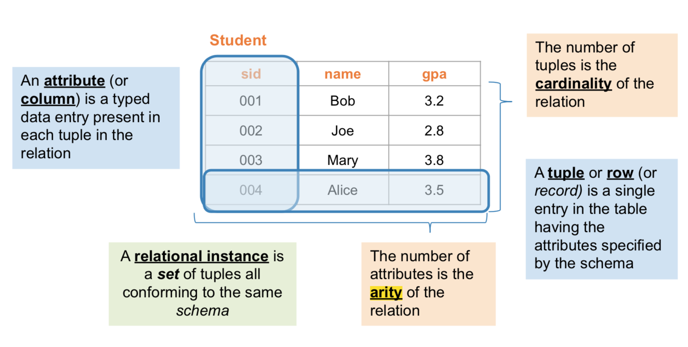

___
### Lecture 5-6: Design Theory

#### First-Normal Form: completely flat
  - Types must all be atomic!
  - Cannot have a cell storing `{cs145, cs229}`
  - Split into tables to avoid anomalies.
    * redundancy
    * update, delete, insert anomalies.

#### Functional dependencies
* Like a hash function.
* One direction does not imply the reverse. (e.g. hash collision).
* Armstrong rules on closure operation
  - Split/combine (right hand side only!)
  - reduction (trivial)
  - transitivity

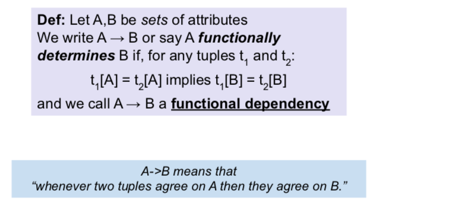

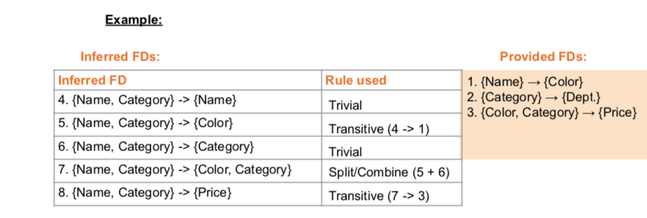


#### Key, Superkey, Closure
* Superkey (set) functionally determines every other attribute.
  - Superkey X+ includes all columns.
* Key is a minimum superkey.

How to infer all FDs:
1. Find X+ for every subset X of columns.
2. Enumerate all FD which do not include trivial reduction.
3. If X+ is all columns, X+ is superkey. The smallest X+ is key.

#### Decomposition
* Lossless Decomposition: joining decomposed table reconstructs original table.
* *Normalized*: keep decomposing table (lossless).

#### Boyce-Codd Normalized Form (BCNF)
Good FD: superkey X determines everything else. If not:
* X determines some of the columns.
* Other columns can be duplicated.
* redundancy leads to anomaly.  
* The bad FD is not in BCNF.
* Break bad FD into two tables.
  - recurse until there is no bad FD in each table.
  - decomposition may not be unique.
* **3NF**: more relaxed, can be BCNF or part of any key.


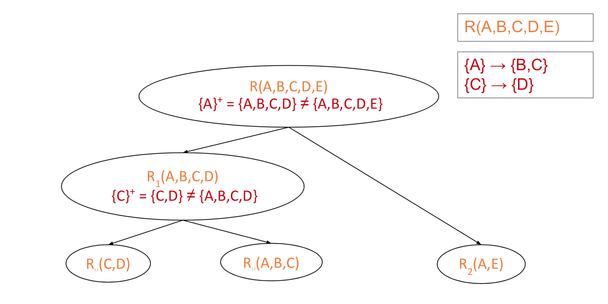

#### Multi-valued Dependencies (MVD)
* Conditionally independent columns cannot be expressed by FD
* Simple example: cross product of two columns.

___
### Lecture 7-9: Transaction
RAM vs Disk:
* Fast but limited;
* Expensive;
* Volatile (temporary);

Latency number every engineer should know.


Transactions are a programming abstraction that enables the DBMS to handle *recovery* and *concurrency* for users.

A transaction (“TXN”) is a sequence of one or more operations (reads or writes) which reflects a single real-world transition.
*  In the real world, a TXN either happened completely or not at all

Motivation:
* Recovery & durability: in case of crash, aborts, system shutdowns
* Concurrency: parallelizing TXNs without creating anomalies
  - throughput (# transactions); latency (time for single transition)


```SQL
START TRANSACTION;

ROLLBACK;

COMMIT;
```

ACID Properties of transaction:
* Atomicity: State shows either all the effects of txn, or none of them
  - **logging**
* Consistency: Txn moves from a state where integrity holds, to another where integrity holds
  - user-defined constraints hold (e.g. balance can't be negative)
* Isolation: Effect of txns is the same as txns running one after another
  - during concurrent queries, should not be able to observe changes from other transactions during the run
  - **locking**
* Durability: Once a txn has committed, its effects remain in the database
  - effect persists after whole program terminates, power failure, crash etc.
  - does not guard against media failure (earthquake)

> ACID is an extremely important & successful paradigm, but still debated!

#### Logging - Atomicity & Durability
* Is a list of modifications
* Log is duplexed and archived on stable storage.
* Record UNDO information for every update.
* The log consists of an *ordered list of actions*
  - `<XID, location, old data, new data>`
  - changes are continuously logged during a transaction.

Write to disk: **Write Ahead Logging (WAL)**
* Commit: after we’ve written log to disk but before we’ve written data to disk
* If crash, not durable, because update has not been written to disk.
* When restart, roll back all logged action, if any action remained uncommitted. Notify developers.

> Upon restart, that program might need to know whether the operation it was performing succeeded, succeeded partially, or failed. If a write-ahead log is used, the program can check this log and compare what it was supposed to be doing when it unexpectedly lost power to what was actually done. On the basis of this comparison, the program could decide to undo what it had started, complete what it had started, or keep things as they are. [wikipedia](https://en.wikipedia.org/wiki/Write-ahead_logging)

Alternative: Cluster Model
* Duplicated across N machines.
* RAM do not fail at the same time.
* **faster** to write on a different machines RAM.
* Power on different racks are uncorrelated by design.
* Still keeping a log.

#### Concurrency
* Concurrency achieved by interleaving TXNs such that isolation & consistency are maintained
* We formalized a notion of serializability that captured such a “good” interleaving schedule
* The DBMS has freedom to interleave TXNs
* However, it must pick an interleaving or schedule such that isolation and consistency are maintained
* A **serial schedule** is one that does not interleave the actions of different transactions
* A and B are **equivalent schedules** if, for any database state, the effect on DB of executing A is identical to the effect of executing B
* A **serializable schedule** is a schedule that is equivalent to some serial execution of the transactions.

Classic anomalies / conflict
* Unrepeatable read (RW conflict): another transaction completes between two reads of the same transaction.
* Dirty read (WR conflict): read uncommitted data (aborted transaction)
* Inconsistent read (WR conflict): read from partial commit
* partially lost update (WW conflict)
* cannot have RR conflict.

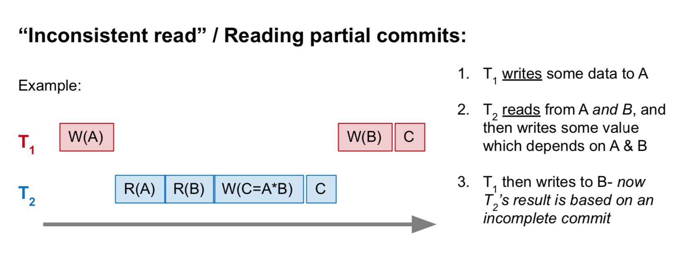

* Conflict is a property of transaction.
  - Two actions conflict if they are part of different TXNs, involve the same variable, and at least one of them is a write
* Anomaly is a property of schedule.

Two schedules are conflict equivalent if:
* They involve the same actions of the same TXNs
* Every pair of conflicting actions of two TXNs are ordered in the same way

Schedule S is **conflict serializable** if S is conflict equivalent to some serial schedule.
* conflict serializable ensures serializable, and consistency and durability.

#### Conflict Graph
Ti→Tj if any actions in Ti precede and conflict with any actions in Tj.

>  Theorem: Schedule is conflict serializable if and only if its conflict graph is **acyclic**

#### Two-Phase Locking (2PL)
Guarantee conflict serializable (serializable, isolation, consistency).
* An X (exclusive) lock on object before writing. If a TXN holds, no other TXN can get a lock (S or X) on that object.
* An S (shared) lock on object before reading.  If a TXN holds, no other TXN can get an X lock on that object.
* All locks held by a TXN are released when TXN completes.
  - Locks accumulates during transaction.
  - Released at once upon transaction completion.
* Deadlock:
  - detection
  - prevention


Optimistic locking: only check for conflict retroactively, upon commit (e.g. Google Doc)

___
#### Lecture 12-14 Index
> An index is a data structure mapping search keys to sets of rows in table

An index can store
* full rows it points to (primary index), OR
* pointers to rows (secondary index) [much of our focus]

An index covers for a specific query if the index contains all the needed attributes- meaning the query can be answered using the index alone!
* The “needed” attributes are the union of those in the SELECT and WHERE clauses

Index operation
* **Search**: Quickly find all records which meet some condition on the search key attributes
* **Insert / Remove** entries: Bulk Load / Delete.

#### Sorting, Hashing, Counting
Buffer: a region in main memory used to store intermediate data between disk and processes
* a page is fixed-sized array of memory
* a file is a variable-length list of pages
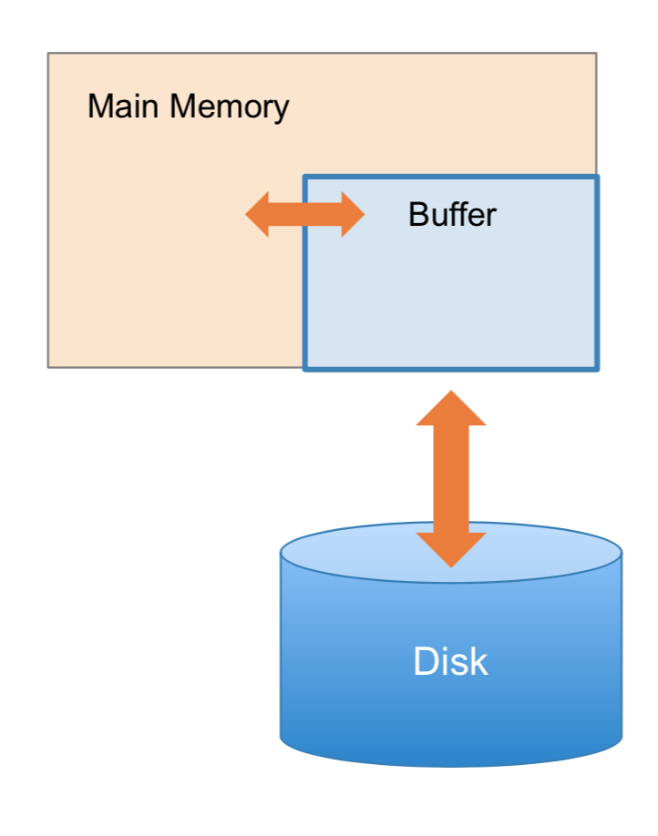

Buffer operating on page and files
* **Read**(page): Read page from disk --> buffer if not already in buffer
* **Flush**(page): Evict page from buffer & write to disk if dirty (modified means dirty).
* **Release**(page): Evict page from buffer without writing to disk

Merge Sorted Files
* Same as merge sort. O(m+n)
* When files are large, disk I/O dominate time complexity. 2(m+n)
* External merge algorithm needs **3** buffer pages to merge two sorted files. (to sort N files, need N + 1 buffer pages)
  - 2*(N+M) IO operations

Merge large files
1. Break files into small files (each called a "run").
2. Sort each sub file.
3. To external merge sort, merging two files at a time.

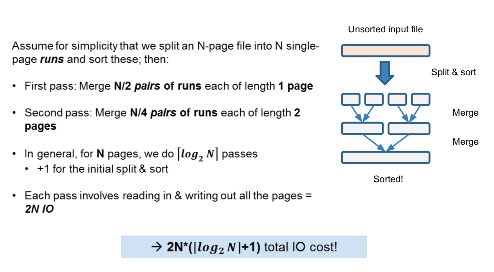

#### B+ Tree
* *IO-aware data structure*
* Not binary tree.
  - fan-out is number of child nodes `d + 1 < f < 2d + 1`
  - large fan-out, shallow depth
* make 1 node = 1 physical page
* Balanced, height adjusted tree
* Make leaves into a linked list
* Parameter d = the degree
  - maximum number of keys in nodes
  - leave empty room as "slack" (**fill-factor** < 1)
  - a key is a search key, not table key.
* Non-Leaf node can have `d~2d` keys.
  - has pointer to more specific range node
* Root node can have `1~2d` keys.
* The N keys in a node defines N + 1 interval of ranges (sorted order)
* Leaf nodes have pointers to data.
  - Each leaf node has pointer to next leaf node.

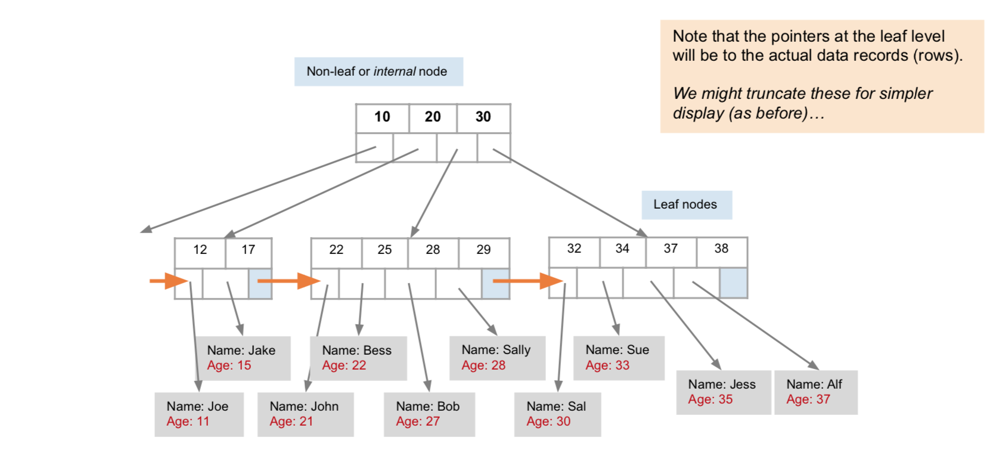
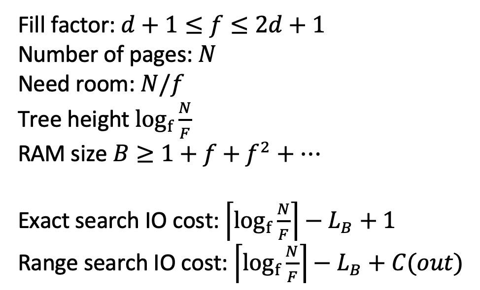
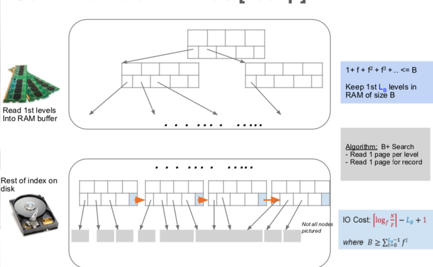

#### Clustered vs. Unclustered Index
An index is clustered if the underlying data is ordered in the same way as the index’s data entries
* No difference in exact lookup.
* a big difference for range queries too

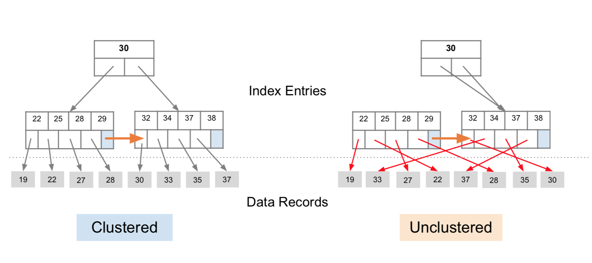

#### Counting (Nov 15 Lecture)
* Use case: product view
* Smarter disk strategy (sorting)
* Smarter partition (hashing, parallelism)
* Simplify, Approximate the problem

___
#### Lecture 17: Query Optimization (Nov 27)
Bad idea to run query as declared; analyze search cost with hash table, B+ tree. Be aware of IO cost.

```
T(R): # tuples in table R
P(R): # pages in table R
```

#### Two-Table Join
**Nested Loop Join (NLJ)**

Nested loop has quadratic complexity of disk IO.
* Switching R, S makes a difference.

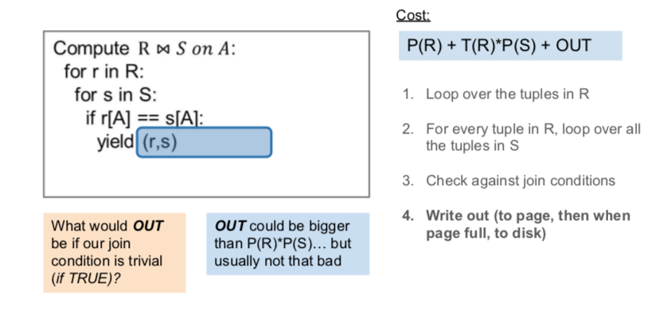

**Block Nested Loop Join (BNLJ)**
* Operate on the level of blocks. Not reading one page multiple times.
* by loading larger chunks of R, we minimize the number of full disk reads of S
* We only read all of S from disk for every (B-1)-page segment of R!
* Still the full cross-product, but more done only in memory

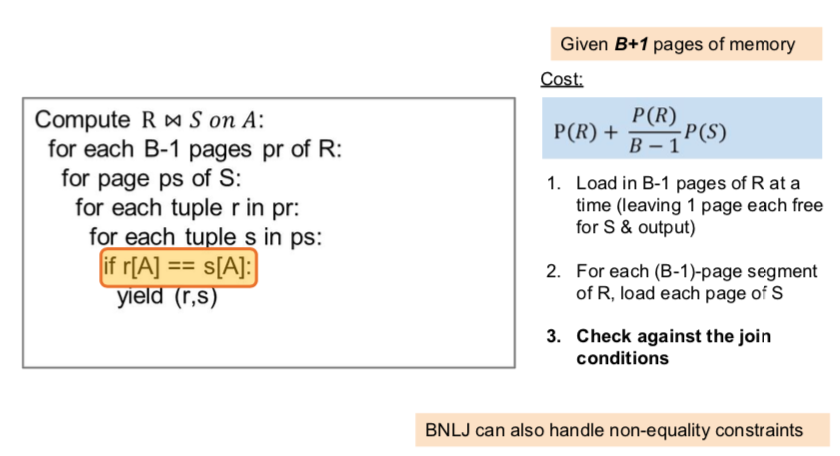

**Index Nested Loop Join (INLJ)**
* Take advantage of equality join (only applicable to equi-join).
* Almost linear time IO.


#### Multi-Table Join
**Sort Merge Join**
* only applicable to equi-join
* To merge N sorted files, need N + 1 page buffer.
* When join key do not contain duplicate: `P(S) + P(R)`
* When join keys are all duplicate, get cross product: `P(S) * P(R)`
* Outperform BNLJ when buffer size is small.
* Optimization:
  - B-way join sorted sub-files.
* Most efficient if tables already sorted (skip sorting phase)!

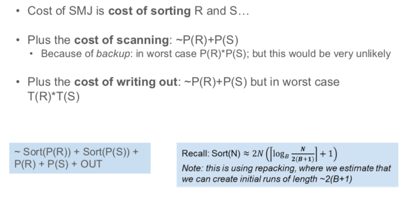

**Hash Join**
1. Hash Partition: Split R, S into B buckets, using hB on A
  - if buffer has size B + 1 pages, hash B buckets (for output), leave 1 page for input.
  - use multiple hash functions to avoid collision.
2. Per-Partition Join: JOIN tuples in same partition (i.e, same hash value)
  - do whatever join necessary
* only applicable to equi-join (hash to same bucket)

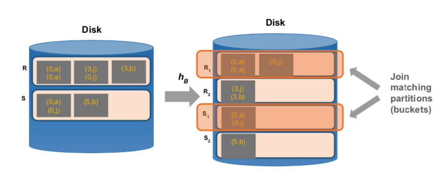
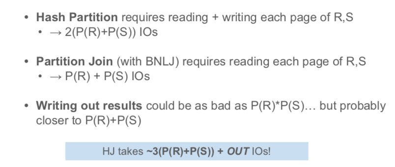

compare
* Hash Joins are highly parallelizable
* Sort-Merge less sensitive to data skew and result is sorted

**Histogram**
* Parameters: # of buckets and type (equiwidth, equidepth)
* require that we update them
* One popular approach: **compressed histogram**
  - Store the most frequent values and their counts explicitly
  - Keep an equiwidth or equidepth one for the rest of the values

#### Relational Algebra
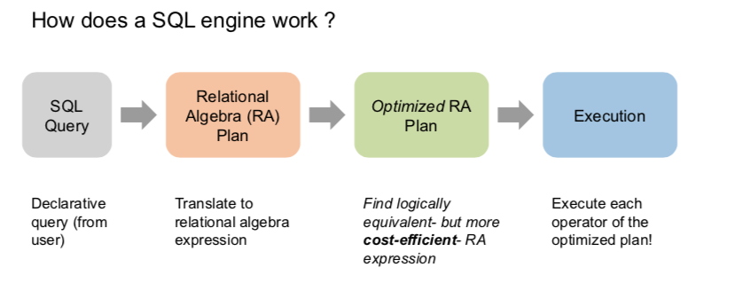

**Relational Algebra** allows us to translate declarative (SQL) queries into precise and optimizable expressions!
* Projection produces a subset of columns.
* a.k.a. "logical optimization"

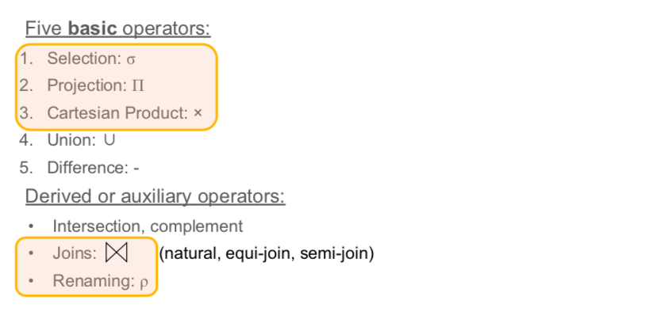
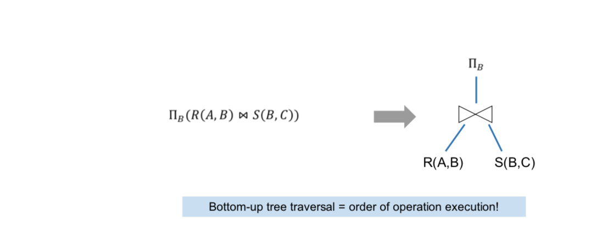

* To find equivalent tree, perform "push down" projection down the tree.
* Want to push selection and projection as early as possible!
  - results in fewer tuples early on
  - Push projection through (1) selection, (2) join
  - Push selection through (3) selection, (4) projection, (5) join
  - Reorder join if needed

> push down selections and projections

#### Data System Design
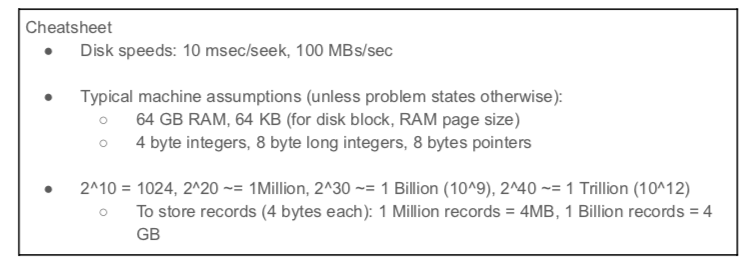
