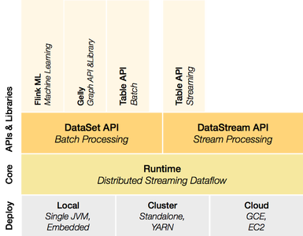

### Apache Flink
Open source platform for distributed steam and batch processing.



* Speed: Flink > Spark > Hadoop
* Stateful Stream Processing: pocessing takes a state as input
* exactly-once consistency guarantees
* connector for Apache Kafka, AWS S3
* key-value based state

#### Event vs Processing Time
* Best to window by event time.
* Need to extract event time from data.
* Watermark: I don't expect thing older than this again.
* `setStramTimeCharacteristic`

#### Fault Tolerance
* Losing state! Need to recover.
* Check point: `enableCheckpointing`
* Safe point: a consistent state image that can be used as a starting point for compatible applications
  - can return at any time
  - A/B testing
* Re-processing: return to a safe point, run updated code

#### Classic Use Case
**Event-driven Application**
* stateful stream processing applications: data and computation are co-located
* co-located: better throughput and latency
* changes to the data representation or scaling the application requires less coordination.

**Data Analytics Application**
* Output results to external database or internal state.
* Lower latency because of eliminating periodic import and query execution.
* ANSI-compliant SQL
* Lower level: DataStream API or DataSet API
* Gelly library: graph analytics on batch data sets

**Data Pipeline Applications**
* Bad: Often ETL jobs are periodically triggered to copy data from from **transactional** database systems to an **analytical** database or a data warehouse.
* Good: continuously consume and emit data
* High-level control: Flink’s SQL interface (or Table API)
* Low-level control: DataStream API
* Connector: Kafka, Kinesis, Elasticsearch, and JDBC database systems

**Example**:
* Search index: price update, description, availability (now high ranking for a sold-out product)
* A/B testing: evaluate performance continuously.
> Online logs (impressions, clicks, transactions) are collected and processed by a parser and filter then later joined together using some business logic.

* Online ML: real-time feature update product CTR, inventory, clicks

#### Alternatives
* Samza, Storm: inflexible for batch processing.
* Spark: no split operator
  - always trade-off between throughput and latency
  - tuning incurs *redeployment cost*.
  - must read entire state for each micro batch
  - performance degrades as state increases, but does not crash
* Flink: low latency and high throughput.
  - increasing throughput has limited effect on latency
  - only read state for a specific key
  - may crash due to out of memory error

#### Getting Started
Start up Flink with the commands, which will start a simple UI on localhost:8080, a job manager and a task manager.

```bash
./bin/start-cluster.sh  # Start Flink
./bin/stop-cluster.sh # Stop Flink
```

Run Flink job.

```bash
# use netcat to start local server via
nc -l 9000

# submit Flink job
./bin/flink run examples/streaming/SocketWindowWordCount.jar --port 9000
```

#### Resource
Robust Stream Processing with Apache Flink [[Local](videos/robust_stream_processing_with_apache_flink.mp4)][[Youtube](https://www.youtube.com/watch?v=kyLtjuz5A0c)]
Complex Event Generation for Business Process Monitoring using Apache Flink [[Link](https://jobs.zalando.com/tech/blog/complex-event-generation-for-business-process-monitoring-using-apache-flink/)]
* Blink: How Alibaba Uses Apache Flink [[Link](https://ververica.com/blog/blink-flink-alibaba-search)]
* Continuous ETL in e-commerce [[Link](https://jobs.zalando.com/tech/blog/apache-showdown-flink-vs.-spark/)]
* Introducing AthenaX, Uber Engineering’s Open Source Streaming Analytics Platform [[Link](https://eng.uber.com/athenax/)]
