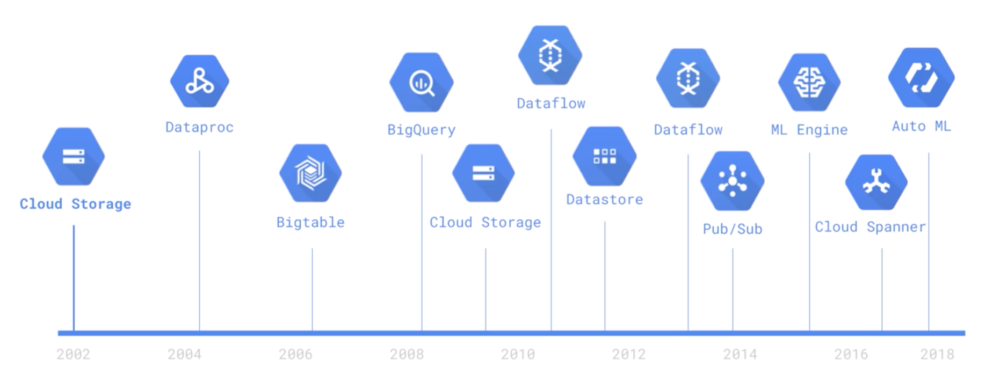

### Introduction to Google Cloud Platform
This folder contains notes for two online courses:
* *Introduction to Google Cloud Platform*([link](https://acloud.guru/learn/gcp-101)).
* *Google Cloud Platform Big Data and Machine Learning Fundamentals* ([link](https://www.coursera.org/learn/gcp-big-data-ml-fundamentals)).

The two courses offer a brief overview of Google Cloud Platform. The objective is to understand what each cloud service does, and its counterpart in AWS.

#### Essentials
* Google buys one out of five CPU produced.
* extremely fast: +1 petabyte / s
* universally accessible. 100 points of presence in the world.
* more reliable, distributed storage, data processing, ML.
* elastic, completely global (auto-scaling).

#### Innovation
* White paper: MapReduce (replaced by Dremel, Flume), Google File System (GFS), Colossus.
    - Dremel (2008): basis of BigQuery.
    - Flume (2010): forms Dataflow.
    - MapReduce: limited by number of nodes for sharding. Use BigQuery and Dataflow instead.
* Open source: Kubernetes.
* Site Reliability Engineers (SREs), not Operations people.
* GCP expects users to have developer background. AWS is more of DevOps.

#### Design Principles
* Global system: intrinsically built for world-wide customers (AWS is regional model, for data sovereignty).
* Physical storage hierarchy: vCPU, physical server, rack, data center, zone, region, multi-region, **private** global network (isolated from internet), point of presence (POPs) -- Network edges and CDN locations (connected to internet).
* Ingress traffic is free. Egress is not. Egress across GCP region is often free.
* No-ops: no system administration overhead.

#### Organization
* Projects ~= AWS accounts.
* Resources can be shared across projects.
* Projects can be grouped in hierarchy.

#### Lecture Notes
* Compute: Compute Engine, Kubernetes Engine, App Engine, Cloud Functions ([note](101_compute.md)).
* Storage: Local SSD, Persistent Disk, Big Query, Cloud SQL/Spanner/Bigtable/Datastore/FireStore ([note](102_storage.md)).
* Networking: Domains, DNS, CLB, CDN, VPC, VPN, Interconnect, Router ([note](103_networking.md)).
* Machine Learning: Cloud ML, Vision API, Speech API, NLP API, Translation, Diaglogflow, Video Intelligence, Cloud Job Discovery ([note](104_machine_learning.md)).
* Big Data: IoT Core, Cloud Pub/Sub, Cloud Dataprep, Cloud Dataproc, Cloud Dataflow, Cloud Datalab, Cloud Data Studio, Cloud Genomics ([note](105_big_data_analytics.md)).
* Roles and Security: Cloud IAM, Service Account, Cloud Identity, Security Key Enforcement, Resource Manager, Cloud Audit Logging, Cloud Key Management Service, Cloud IAP, Security Scanner, Cloud Data Loss Prevention API ([note](106_IAM.md)).
* Operations Management: Stackdriver Monitoring, Logging, Error Reporting, Trace, Debugger, Deployment Manager, Billing API ([note](107_operations_management.md)).
* Development: Cloud Source Repositories, Container Builder & Registry, Cloud Endpoints, Apigee API Platform, Test Lab for Android ([note](108_dev_API.md)).

#### Useful Links
* Why Google Cloud: https://cloud.google.com/why-google/
* Publication database: https://ai.google/research/pubs
* Google Cloud Platform: https://cloud.google.com/
* Data Center: https://www.google.com/about/datacenters/
* Google IT Security: https://cloud.google.com/files/Google-CommonSecurity-WhitePaper-v1.4.pdf
* Pricing Philosophy: https://cloud.google.com/pricing/philosophy/
* Compute Engine: https://cloud.google.com/compute/
* Storage: https://cloud.google.com/storage/
* Pricing: https://cloud.google.com/pricing/
* Cloud Launcher: https://cloud.google.com/launcher/
* Cloud SQL: https://cloud.google.com/sql/
* Cloud Dataproc: https://cloud.google.com/dataproc/
* Cloud Solutions: https://cloud.google.com/solutions/

#### Extended Reading
* Big data and machine learning blog: https://cloud.google.com/blog/big-data/
* Google Cloud Platform blog: https://cloudplatform.googleblog.com/
* Google Cloud Platform curated articles: https://medium.com/google-cloud
