### SQL Tools
* Hive
* Impala
* Presto (like Impala)
* Phoenix

#### Hive
* Hive SQL, close to SQL. (Hive is not a database)
* Translate SQL to MapReduce/Spark/Tez/LOAP (4 flavors) jobs.
* Hive is a top layer that translates.
  - parse HiveQL.
  - Optimize.
  - Plan execution.
  - Submit to cluster.
  - Monitor progress.

#### Impala
* An actual database server.
* Very, very fast query (milliseconds).
* End-to-end continuity: HDFS, HBase tables, Kudu, S3
  - parse HiveQL.
  - Optimize.
  - Plan execution.
  - Submit to cluster.
  - Monitor progress.
* Impala executes plan on Hadoop cluster.
* Does not have its metadata store. Use Hive's metadata store.
* Doesn't scale beyond a few hundred nodes (Hive scales to 8,000 nodes).

> Many business intelligence tools support Hive and Impala (e.g. Tableu, excel for grownups).


___
#### Common between Impala & Hive
* Support UDF (user-defined functions).
  - if too many UDF, use Spark instead.
* Speak SQL 92.
* Share same data warehouse & metadata storage.
  - *Both separate metadata from data.*
  - metadata are stored in database (e.g. MySQL).
  - Typical ingest: *schema-on-write*.
  - Hive & Impala: *schema-on-read*.
    * Create metadata to represent table. Underlying data don't change.
* Often used together.

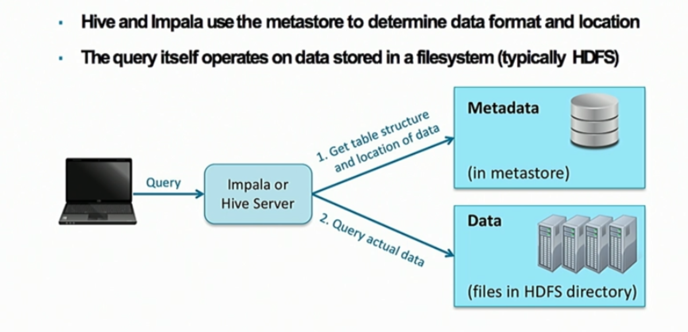

#### Compare to DBMS
* Databases are
 - great for transactional queries. Hadoop is not replacement.
 - very fast response time.
 - allow updating existing records.
 - Serve thousands of simultaneous clients.
- Hive & Impala:
  * no support updating & deletion;
  * no transaction;
  * no referential integrity.

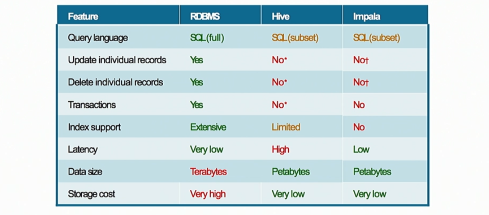

#### Fault Tolerance
* Hive takes advantage of MapReduce/Spark fault tolerance.
* Impala: single node fail, query fails. Must run again.

___
#### Table
* Maps to a directory.
* A directory can contains multiple files.
* Cannot have sub-directories.
* Data are meaningless. Context is given by metastore.
* A table belongs to a database.
  - Hive & Impala support multiple databases.

```SQL
USE accounting;
SHOW tables;

SHOW tables IN sales;

DESCRIBE orders;

-- more details
DESCRIBE FORMATTED orders;
```

___
#### Syntax
* Keyword: SELECT, FROM, WHERE, AS (not case sensitive).
* semicolon terminated;
* Impala support c-style block comment.
* `*` selects all columns.
* De-duplicate: `DISTINCT` keyword.
* **identifier** identifies table, column.
  - avoid keyword clashes, use quoted identifier:
  ```
  SELECT `select` from ...
  ```
* Sort: Impala does not require sorted column in SELECT. Hive does.
* Single equal for equality.
* Table alias: `AS` (optional).
* Logical: `AND`, `OR`, `In`.
* Hive & Impala support subqueries in `FROM` & `WHERE` clause (must be named).

| Header One     | Uncorrelated   | Correlated     | Scalar         |
| :------------- | :------------- | :------------- | :------------- |
| Hive           | Yes            | Limited        | No(C6.0)       |
| Impala         | Yes            | Yes            | Yes            |

* Combine result with UNION, UNION ALL
  - UNION applies a DISTINCT operation
* JOIN: inner, left/right join, outer(full) join, semi-join
  - HIVE supports equality join! Not inequality join (Impala supports).
    - Impala: `!-, <>, <, <=, >, >=, BETWEEN`
  - Put largest table first.
  - `NULL = NULL` is dropped, not treated as match.
    - To support **NULL-safe join**: `c.cust_id <=> o.cust_id`
  - avoid cross join:

```sql
-- cross JOIN
SLECT * FROM disks CROSS JOIN sizes;
SLECT * FROM disks JOIN sizes;
SLECT * FROM disks, sizes;
```

* LEFT SEMI JOIN: use left table to filter rows on right table.

#### Advanced Syntax
**Window**
* `OVER (PARTITION BY ORDER BY)`
  - each set of rowss is called a window
* Does not change number of rows (even aggregate functions)
  - GROUP BY keeps one row per group.

**Rank**
* Used with dinwos
* PERCENT_RANK: (RANK - 1) / (NUM_ROWS - 1)
* CUME_DIST: proportion of rows with values <= CDF

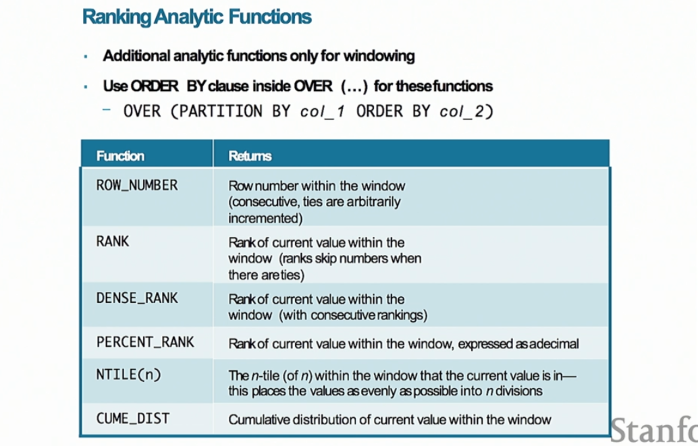

**Offset**
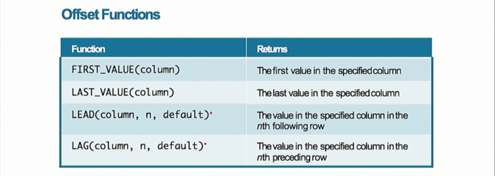
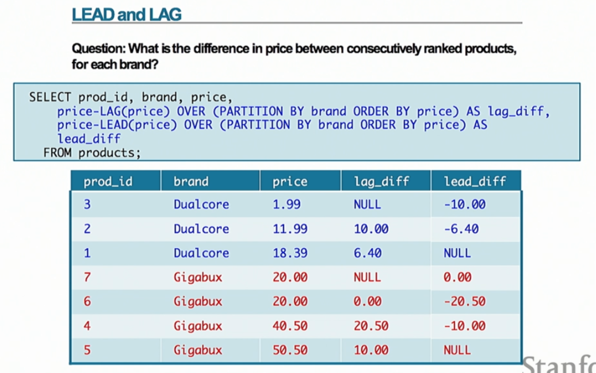

**Sliding Window**
* Relative to current row
  * ties are cumulative (in the case of sum)
* Example of bounds:
  - ROWS BETWEEN 2 PRECEDING AND 3 FOLLOWING
  - ROWS BETWEEN CURRENT ROW AND 3 FOLLOWING
  - ROWS BETWEEN UNBOUNDED PRECEDING AND 3 FOLLOWING
  - ROWS BETWEEN 2 PRECEDING AND CURRENT ROW
  - ROWS BETWEEN 2 PRECEDING AND UNBOUNDED FOLLOWING

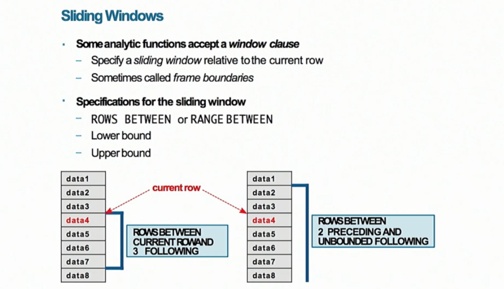

```sql
SELECT this_date, daily,
  SUM(daily) OVER (ORDER BY this_date
    ROWS BETWEEN 2 PRECEDING AND CURRENT ROW) AS three_day
  FROM
    (SELECT to_date(posted) AS this_date, COUNT(rating) AS daily
      FROM ratings WHERE prod_id = 1234567
      GROUP BY this_date HAVING this_date > "2013-04-30") AS s;
```

* ROWS BETWEEN
  - ties are cumulative (in the case of sum)

```sql
SELECT this_date, daily,
  SUM(amount) OVER (ORDER BY month
    ROWS BETWEEN UNBOUNDED PRECEDING AND CURRENT ROW) AS row_sum,
  SUM(amount) OVER (ORDER BY month
    RANGE BETWEEN UNBOUNDED PRECEDING AND CURRENT ROW) AS range_sum
  FROM deposits;
```

* RANGE BETWEEN
  - ties are NOT cumulative (in the case of sum)

___
#### Datatypes
* Integer: TINYINT, SMALLINT, INT, BIGINT.
* Decimal: FLOAT, DOUBLE, DECIMAL(p, s).
  - Never use float or double to store currency value.
* Character: STRING, CHAR(n), VARCHAR(n).
* Other: BOOLEAN, TIMESTAMP, BINARY.
  - more common to use string than TIMESTAMP.
* Hive does forceful conversion. Impala requires strict typing.
* Out of range: Hive returns NULL. Impala returns maximum/minimum.


```sql
-- check NULL rows
SELECT c.cust_id, name, total
FROM customers AS c
FULL OUTER JOIN
orders AS o
WHERE c.cust_id IS NULL
OR o.total IS NULL;
```

#### Complex Datatypes: Hive
* Hyper-denormalizing beyond normal DBMS allows.
  - e.g. a person may have multiple phone numbers.
* Array
  - `phone ARRAY<STRING>`
  - Set `COLLECTION ITMES TERMINATED BY '|'`
* Map
  - `phone MAP<STRING, STRING>`
  - `COLLECTION ITMES TERMINATED BY '|'`
  - `MAP KEYS TERMINATED BY ':'`
* Struct
  - Each field can have a different data type (e.g. JSON).
  - `SELECT address.street, address.city`
  - `address STRUCT<street:STRING, city:STRING>`

```sql
CREATE TABLE customer_addr (
  cust_id STRING,
  name STRING,
  address STRUCT<street:STRING, city:STRING>)
ROW FORMAT DELIMITED
  FIELDS TERMINATED BY ','
  COLLECTION ITEMS TERMINATED BY '|';
```

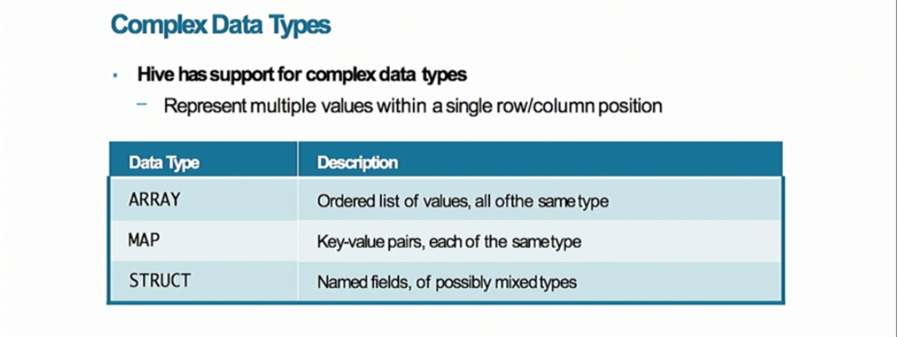

* Function against collection:
  - `SIZEOF()`
  - `EXPLORE(phones)` pass in on column, like `flatMap`
    * CANNOT USE `SELECT name, EXPLORE(phones) ...`
    * Use lateral view

```sql
-- if Alice has 3 phones, 3 rows are returned for Alice
SELECT name, phone FROM customer_phones
LATERAL VIEW explore(phones) p AS phone;
```

#### Complex Datatypes: Impala
* Lately added. Not as sophisticated as Hive.
* Data format must be Parquet.
* Cannot select complex columns directly.
* `SELECT *` leaves out complex columns.

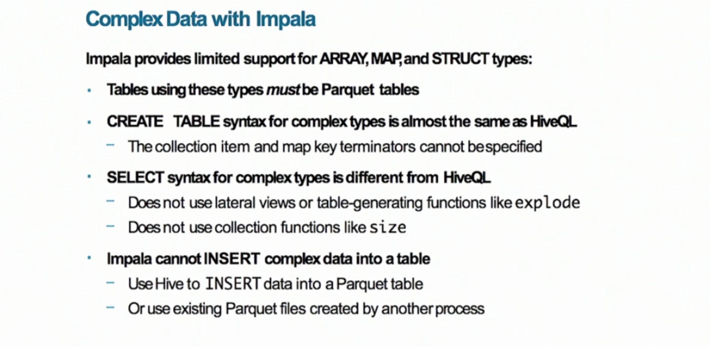
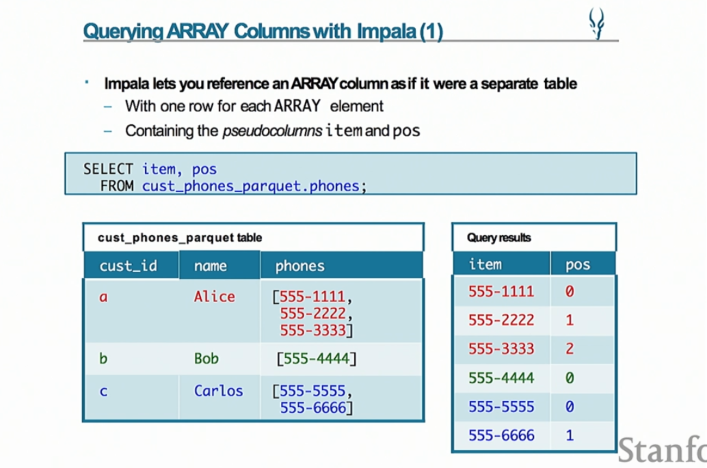

```sql
SELECT name, phones.item AS phone
FROM customer_phones_parquet, customer_phones_parquet.phones;
```

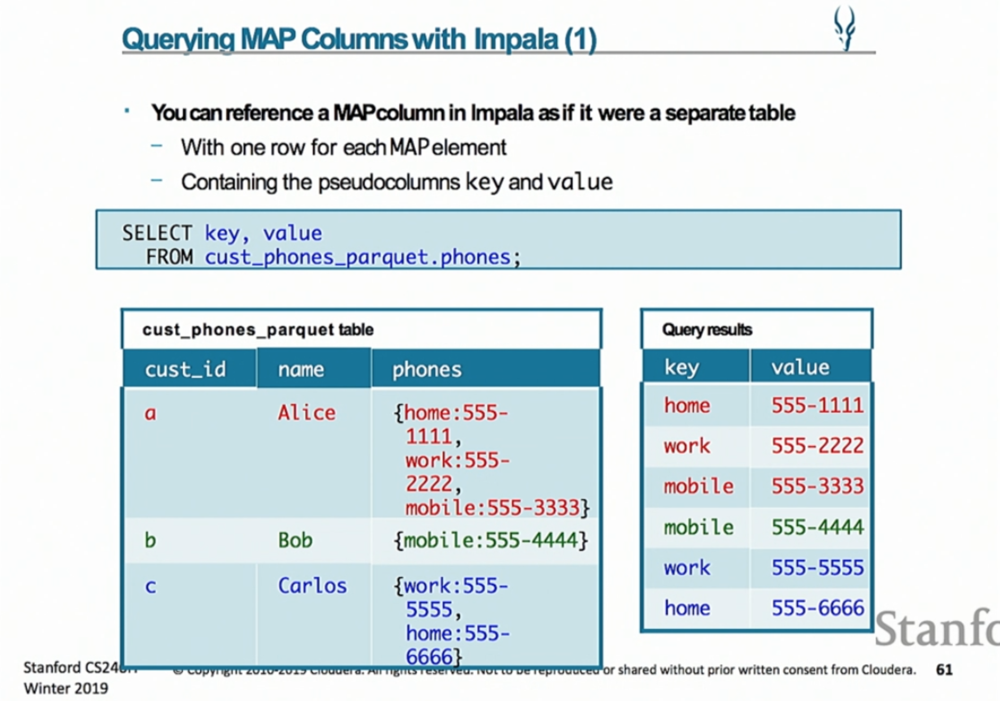

```sql
SELECT name, phones.value AS home
FROM customer_phones_parquet, customer_phones_parquet.phones
WHERE phones.key = 'home';
```

```sql
-- struct field
SELECT name, address.state, address.zipcode,
FROM customer_phones_parquet;
```

**Load Complex Data**
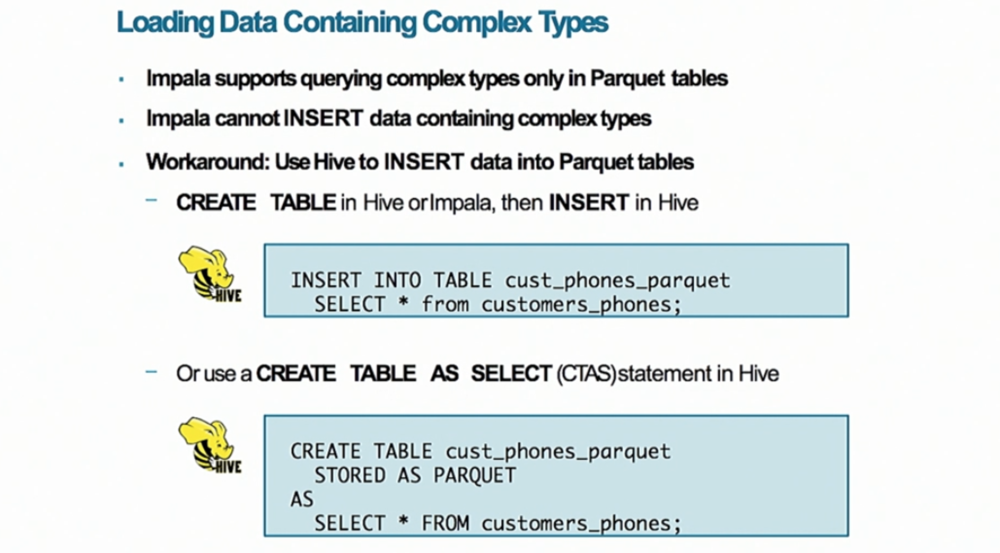

**Hyper-denormalizing**
* Time 20190306 1:03:30
* Create, Load, Query

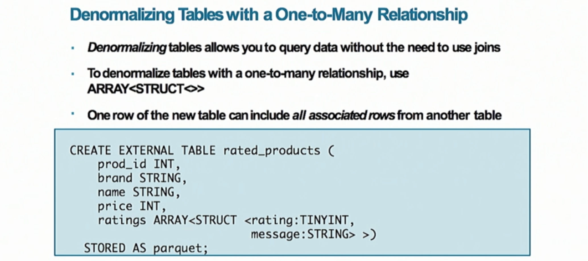

```sql
INSERT OVERWRITE TABLE rated_products
  SELECT p.prod_id, p.brand, p.name, p.price,
    collect_list(named_struct('rating', r.rating, 'message', r.message))
  FROM product p LEFT OUTER JOIN rating r
  ON (p.prod_id = r.prod_id)
  GROUP BY p.prod_id, p.brand, p.name, p.price;

-- query
SELECT brand, name, COUNT(ratings.rating) num_ratings,
  AVG(ratings.rating) avg_rating
FROM rated_products, rated_products.num_ratings
GROUP BY brand, name
ORDER BY nvl(avg_rating, 0) DESC
LIMIT 30;
```

___
#### Text Processing
**Regular Expression**
* Time 20190306 1:08:00
* Great for free-form text (e.g. product review)
* Case sensitive.
* Impala has case-insensitive: `IREGEX`

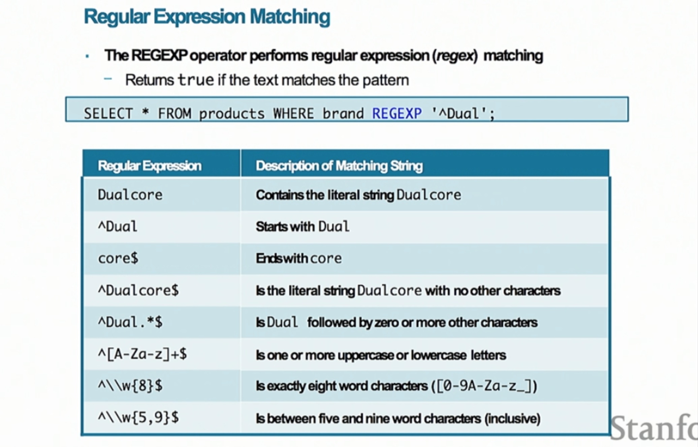

* `REGEXP_EXTRACT` returns matched text
* `REGEX_REPLACE` replace matched text

**SerDe**
* Hive handle CSV: `OpenCSVSerde`
  - Default SerDe: `WITH ROW FORMAT DELIMITED FIELDS TERMINATED BY ','`
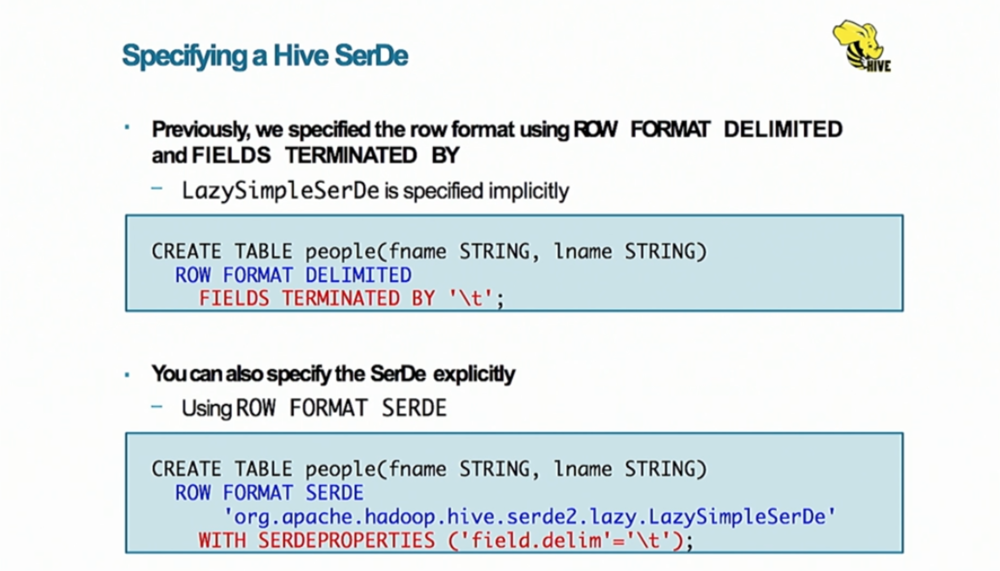
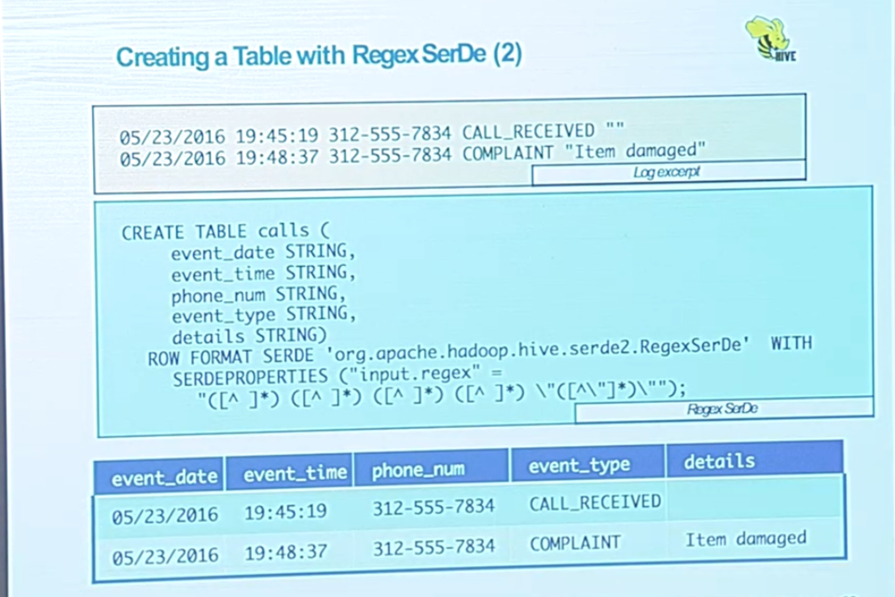
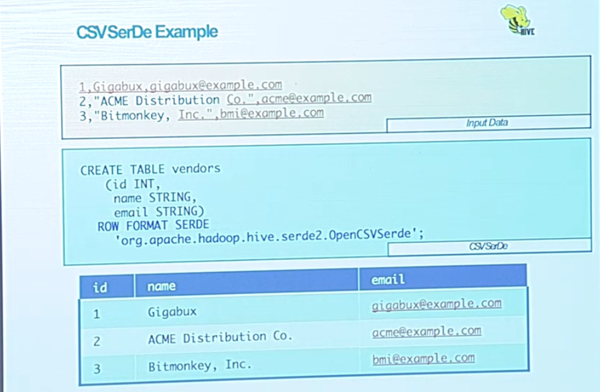

**Sentiment Analysis**
* Split: `SELECT split(names, ',') FROM people`
* Parsing sentences into words: `sentences(txt)`
  - text is parsed into array of array
  - each sentence becomes an array of words

**n-gram**
* Use lower to normalize case.
* Use `explode` to convert `array` to a set of rows/
* `ngrams` returns array of struct: string and estimated frequency

```sql
SELECT explode(ngrams(sentences(lower(txt)), 2, 4)) FROM ...

-- passing a pattern: NULL is placeholder
SELECT explode(context_ ngrams(sentences(lower(txt)), ARRAY("new", "computer", NULL, NULL), 3)) FROM ...
```

___
#### Interface
* HUE web UI: Hive query editor; Impala query editor; metastore manager.


* Command-line shell: beeline shell (written in Java), impala shell (written in C).


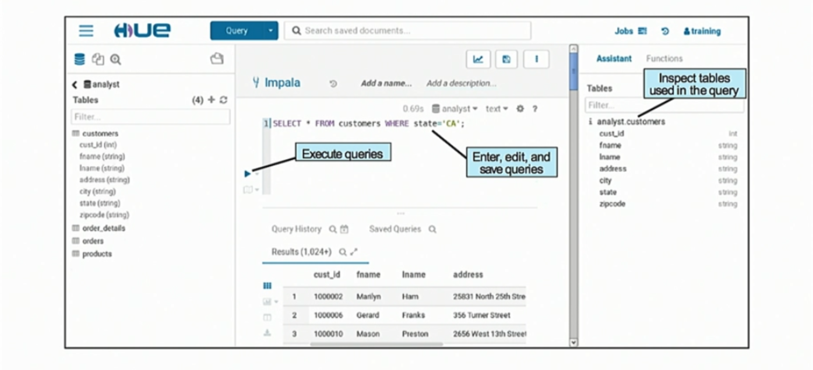

``` bash
# execute file
$ impala-shell -f myquery.sql

# run query
$ impala-shell -q "SELECT * FROM users"

# use --quiet to suppress information
$ impala-shell --quiet -f myquery.sql

# use -o to output to file, optional set delimiter
$ impala-shell -f myquery.sql --delimited --output_delimiter="," -o results.txt
```

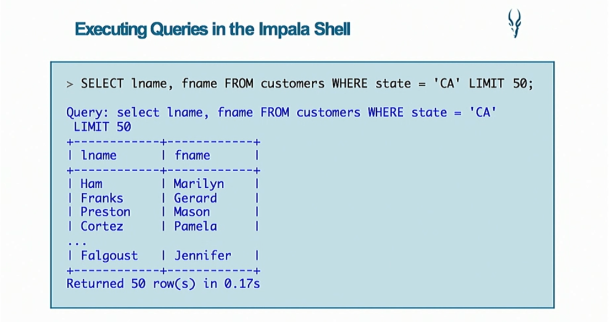

* ODBC/JDBC.

___
#### Common Operation & Functions
* Insert operator between columns (`SELECT first - last FROM ...`).
* Null
  - `IS NULL`
  - `IS NOT NULL`
* `COUNT(*)` returns number of rows; `COUNT(col)` counts non-null.
*

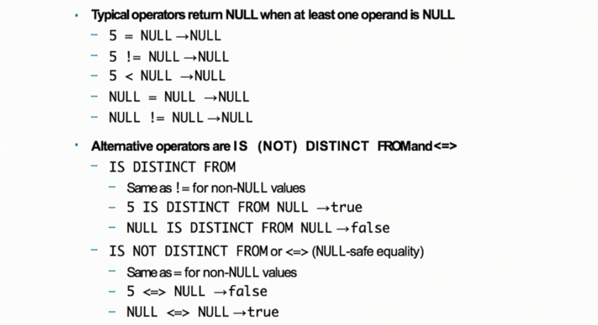

* Columns can have alias
* Tons of built-in functions. Function names case-insensitive.
  - `concat(fname, " ", lname)`
  - arguments can be columns, literal values, expressions.
  - named lowercase.

___
#### Metadata
* Impala caches metadata. Hive does not.
* If Hive makes update to HDFS, Impala metadata is out of sync.
  - needs to refresh Impala.
  - refresh all metadata is expensive.
* Hive & Impala can access metastore with built-in utility. Spark doesn't have.
  - Hive has **HCatalog** that access metastore via CML.


___
#### Manage Tables
* Can set location (absolute path, complete URI (`S3`, `adl`))
* Can externally create table.

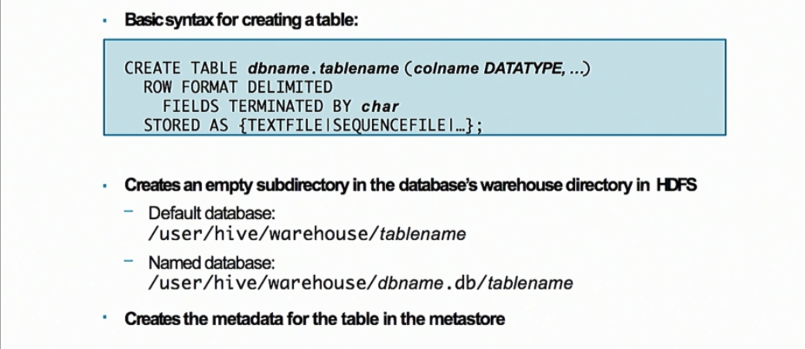


* Removing database (1:23:32)
* Rename and modify table (1:25:22)
* Reorder column (1:25:36)
* Add/remove column (1:25:45)
* Replace column (1:25:47)
* Change other properties (1:26:30)
* Create view (1:27:15)
* Save query results into a table (1:29:25)
* Create table ... AS SELECT (1:29:50)
  - schema inferred from query (alias overwrites column names).
* Can write output to a directory (1:30:40)

___
#### Partitioning
* Not available in traditional SQL.
* All files in a directory are data for **one** table.
  - all files scanned for every query.
* If all you need is to query by customer ID, put customer with same ID in same partition.
  - each partition has a subdirectory.
  - partitioned column becomes a virtual column, not represented in data (saved as dir names)
  - can have nested partitions (risk creating too many partitions)
* static partition: deliberate choice, annoying. (1:36:08)
  - insert new partition: (1) add to metadata (2) create dir (3) moves to dir.
* dynamic partitioning: can screw up everything. (1:37:58)
  - partitioned column must come in the end of SELECT.
* When to partition:
  - read entire dataset takes too long.
    * full scan, throw aways most.
    * When cluster is large, most data are remote (taking over network).
    * Partitioning throws away less.
  - query always use the partitioned column.
  - small cardinality for partitioned column.
    * *small-file-problems*.
    * Running out of memory for name node.
    * May accidentally happens with dynamic partitioning.

___
#### Format
* Avoid txt file! (super-inter-operable, human readable, but slow and ugly)
  - representing number as string waste space.
  - difficult to represent binary data such as images.
  - conversion back/forth to native format takes time.
* SequenceFile:
  - first replacement of txt file.
  - very fast, but poor interoperability. Avoid!
* **Avro**:
  - evolvable; binary encoded; **row-based** (add a column later).
  - Created by Doug Cutting.
  - Good for long-term design.
  - great performance and interoperability.
  - Embed schema in file itself: `CREATE TABLE ... STORED AS AVRO;`
* Columnar file format:
  - RCFile (bad), ORCFile (improved, gaining traction).
  - **Parquet**: comparable to ORCFile. `CREATE TABLE ... STORED AS PARQUET;`
* Consider:
  - Ingest pattern (row vs. columnar);
  - Tool compatibility;
  - Expected lifetime;
  - Storage and performance requirement;

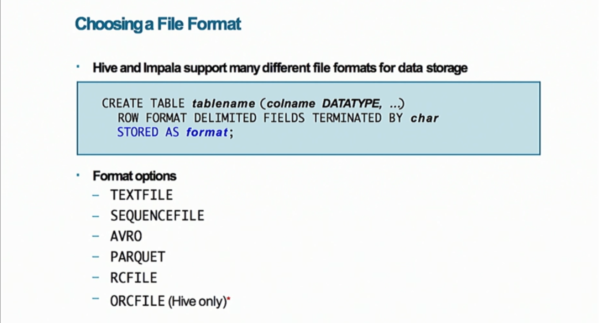

___
#### Optimization
* Hive Fetch task: cannot do wide operation.
* Speed: metadata query < fetch task < map only (narrow) < map-reduce (aggregation) < multiple map-reduce jobs

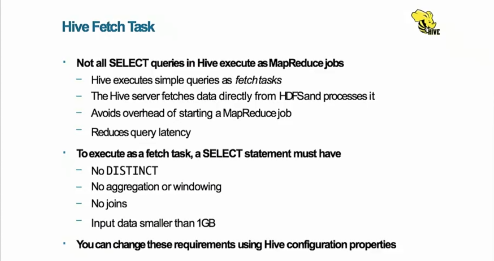

**Execution Plan**
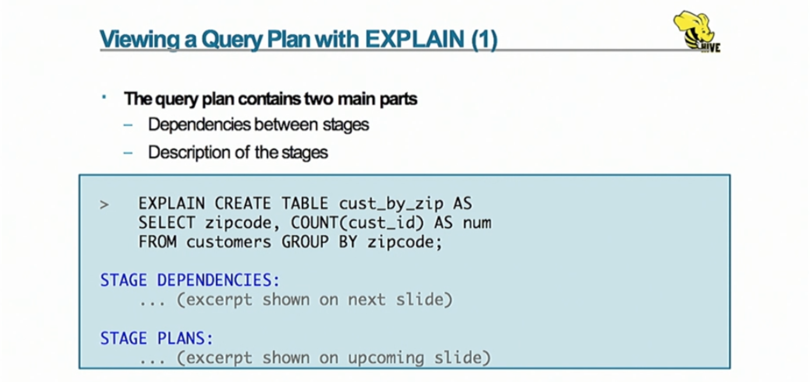
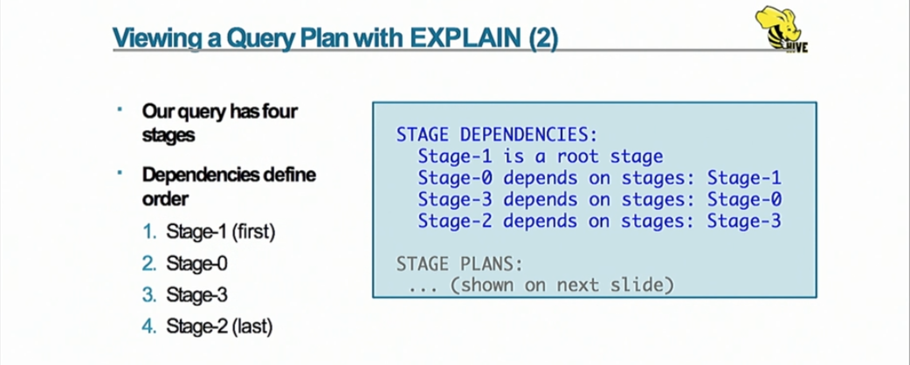

**Parallel Execution**
* Turned off by default.
* Set `hive.exec.parallel` property to true

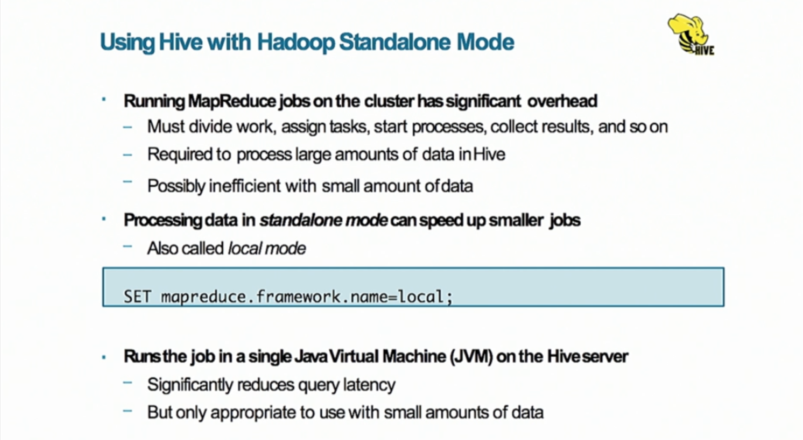

**Bucketing**
* `bucketing` divides data for sampling.
  * Use a column to divide data into N buckets (same as Map hash partitioning)
  * without bucketing, sampling is a full-table-scan.
* Bucketed column should have evenly distributed values (best for ID)

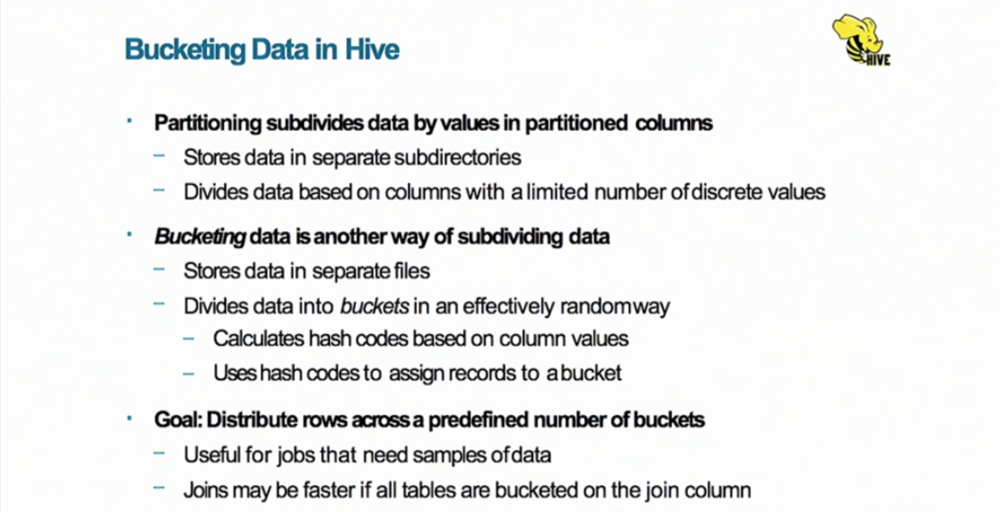

```sql
-- each bucket contains 5% of users
CREATE TABLE orders_bucketed
  (order_id INT,
  cust_id INT,
  order_date TIMESTAMP)
  CLUSTERED BY (order_id) INTO 20 BUCKETS;

INSERT OVERWRITE TABLE orders_bucketed
  SELECT * FROM orders;

-- sample one out of every 10 records (10%)
SELECT * FROM orders_bucketed
  TABLESAMPLE (BUCKET 1 OUT OF 10 ON order_id);
```

___
#### Homework
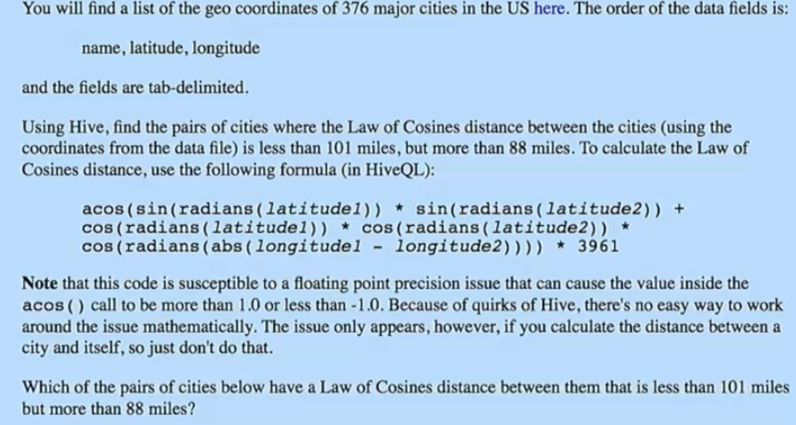

Copy `major_cities.tsv` to HDFS.
```bash
hdfs dfs -ls /user/hive/warehousse
hdfs dfs -ls /user/hive
hdfs dfs -makedir /user/hive/warehouse/cities
hdfs dfs -put /tmp/major_cities.tsv /user/hive/warehouse/cities

# confirm: new dir created:
hdfs dfs -ls !$
# /user/hive/warehouse/cities/major_cities.tsv

# check the tab-limited file
head /tmp/major_cities.tsv

# connect beeline or hive (hive is deprecated)
beeline
```

Impala Shell
```bash
impala-shell --help
impala-shell -i localhost
```

```sql
-- no table
SHOW tables;

-- have a default database
SHOW databases

-- create a table, automatically loaded data
-- table name aligns with DIRECTORY name (not file name)
-- TAB is treated as column!
-- not external: drop table will delete file
CREATE TABLE cities (name STRING, lat DOUBLE, lng DOUBLE);

SHOW tables;
DESCRIBE cities;

-- fix problems
CREATE EXTERNAL TABLE cities2 (name STRING, lat DOUBLE, lng DOUBLE)
ROW FORMAT DELIMITED FIELDS TERMINATED BY "\t";

DESCRIBE cities2;
DESCRIBE FORMATTED cities2;

-- drop safely; won't delete cities
DROP TABLE cities2;

-- fix problems
CREATE EXTERNAL TABLE cities2 (name STRING, lat DOUBLE, lng DOUBLE)
ROW FORMAT DELIMITED FIELDS TERMINATED BY '\t' LOCATION '/user/hive/warehouse/cities';

-- show three columns
SELECT * FROM cities2;

-- cartesian product (cross join)
-- create a map-reduce job
SELECT * FROM
cities2 c1 CROSS JOIN cities2 c2

SELECT
  n1, n2, ACOS(...) dist
FROM
  (SELECT c1.name n1, c1.lat lat1, c1.lng lng1, c2.name n2, c2.lat lat2, c2.lng lng2
  FROM cities c1, cities c2 WHERE c1.n1 != c2.n2) AS _
WHERE dist BETWEEN 88 AND 101;
```
