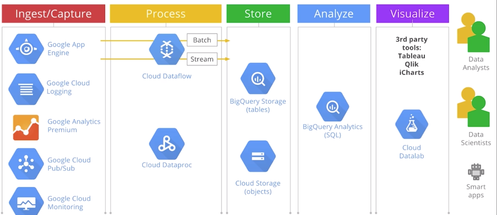

### Serverless Data Analysis with Google BigQuery and Cloud Dataflow
Disadvantage of MapReduce: sharding data into mappers. Reducers aggregates shards of results. Mixing storage and compute: "The amount of machines that you need to do your compute is going to drive how you're going to split your data."

Second generation: Dremel and Pub/Sub that auto-scale.
* Dremel is internal BigQuery tool (same engineering team).
* Have data stored in Cloud Storage in **denormalized** form.



#### Normalizing vs. Denormalizing
* **Normalize**: Normalizing the data means turning it into a relational system. This stores the data efficiently and makes query processing a clear and direct task.
* **De-normalize**: Denormalizing is the strategy of accepting repeated fields in the data to gain processing performance. Data must be normalized before it can be denormalized.
    - further increases orderliness.
    - no longer relational, boosting efficiency, in parallel in columnar processing.
    - Takes more storage space.
* Nested fields combine the two (no example given).

___
### BigQuery
#### Advantage of BigQuery
* Interactive analysis at petabyte-scale for business intelligence (near-real time, for immediate, transaction-level response, use Cloud SQL/Spanner)
* No-ops: pay for amount of data scanned.
* Cluster-less: easy to collaborate, share, mashing up different datasets.

#### Essential Concepts
* Relational databases are row-oriented storage and support transaction updates.
* BigQuery is **columnar**: each column is stored in a separated, compressed file replicated +3 times.
* No indices, partitions or keys is required (partitions can be used to reduce cost).
* To save cost, limit the column to scan.
* Table name format: `<project>.<dataset>.<table>`

___
### Advanced Features
**Array/Struct** to correlate columns during aggregation.
* First bind columns using `ARRAY_AGG`.
* Unpack columns using `ARRAY(SELECT AS STRUCT ...)`.

```SQL
WITH TitlesAndScores AS (
    SELECT
        ARRAY_AGG(STRUCT(title, score)) AS titles,
        EXTRACT(DATE FROM time_ts) AS date
    FROM `bigquery-public-data.hacker_news.stories`
    WHERE score IS NOT NULL AND title IS NOT NULL
    GROUP BY date
)
SELECT date,
    ARRAY(SELECT AS STRUCT title, score FROM
          UNNEST(titles) ORDER BY score DESC LIMIT 2)
AS top_articles
FROM TitlesAndScores;
```

**User-defined Function**(UDF):
* Standard SQL UDFs are scalar; legacy are tabular.
* UDFs are temporary, and valid for current session only.
* Return data <= 5MB
* Can run 6 concurrent JavaScript UDF per project.

```sql
CREATE TEMPORARY FUNCTION
multiply(x FLOAT64, y FLOAT64)
RETURNS FLOAT64
LANGUAGE js AS
"""
return x * y;
"""
```

#### Wildcard Tables
* Richer prefix, faster efficiency!
* Example: `bigquery-public-data.noaa_gsod.gsod*`
* Must be enclosed in backtick

#### Partitioning
* One table may contain a partition column.
* Time-partitioned table: cost-effective way to manage data.
* Similar to sharding: a time partition is analogous to a shard.


##### Other Shared Features
* Join
* Windows
* Regular expression

___
### Performance and Pricing
#### Optimizing Queries
* Input and output in GB.
* Shuffle: how many bytes to pass to next stage.
* Materialization: how many bytes to write.
* GPU work: UDFs.
* Check `explanation plan` before running query.
* Monitor in `StackDriver`.

#### General Guidelines
* Minimize columns to be processed. Avoid `SELECT *`.
* Filter `WHERE` as early as possible to reduce data passed between stages.
* Avoid self join (squaring number of rows).
* Do big join first to reduce rows.
* `GROUP BY`: How many rows are grouped per key? Lower cardinality, higher speed.
* Built-in function > custom SQL function > JS CDFs.
* Use `APPROX_COUNT_DISTINCT` instead of `EXACT COUNT(DISTINCT)`.
* Order in the end, on smallest amount of data.

___
## Dataflow
* An execution framework: **Apache Beam**.
* **Pipeline** a directed graph of steps (cann branch, merge, if-else logic).
* Each step is executed on the cloud by a runner, elasticallt scaled.
* Can code operation in batch data (window optional) and stream data (window required). Same code that process streaming and batch data.
* Input and output are `PCollection` (parallel collection).
    - Supports parallel processing.
    - Not an in-memory collection; can be unbounded.
* Every transformation step accepts a name variable, to be visualized in monitoring console.
    - Better unique.
    - Two overloaded operator: `|`, `>>`.

### Ingest Data
* Source: Pub/Sub, Cloud Storage, BigQuery.
```java
PCollection<string> lines = p.apply(TextIO.Read.from("gs://.../input-*.csv.gz"))
PCollection<string> lines = p.apply(PubsubIO.Read.from("input_topic"))
PCollection<TableRow> rows = p.apply(BigQueryIO.Read.from("SELECT ...;"))
```

* Sink: Pub/Sub, Cloud Storage, BigQuery.
```java
lines.apply(TextIO.Write.to("/data/output").withSuffix(".txt"))
lines.apply(TextIO.Write.to("/data/output").withSuffix(".txt").withoutSharding()) // no sharding for small task
```

* Execute task on cloud (python).
```bash
python ./task.py \
    --project=$PROJECT \
    --job_name=myjob \
    --staging_location=gs://$BUCKET/staging/ \
    --temp_location=gs://$BUCKET/staging/ \
    --runner=DataFlowRunner
```

#### Labs
1. Build a BigQuery Query ([Note](lab_1.md)).
2. Loading and Exporting Data ([Note](lab_2.md)).

#### Resources
* BigQuery documentation ([link](https://cloud.google.com/bigquery/docs/)).
* Tutorials ([link](https://cloud.google.com/bigquery/docs/tutorials))
* Pricing ([link](https://cloud.google.com/bigquery/pricing))
* Client libraries ([link](https://cloud.google.com/bigquery/client-libraries))
