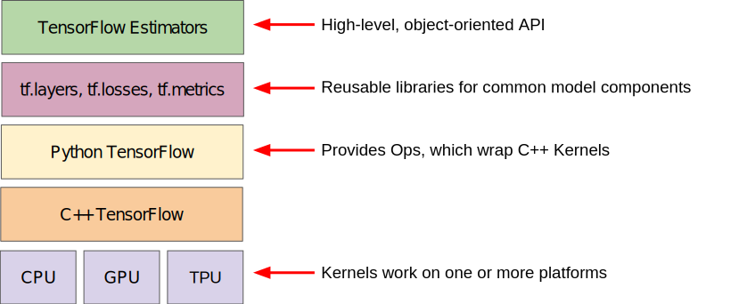
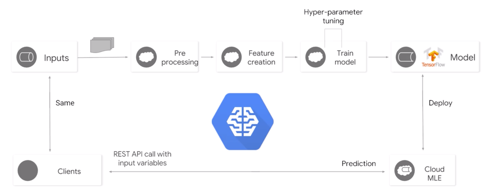

### Serverless Machine Learning with Tensorflow on Google Cloud Platform
This folder contains notes for the Coursera class *Serverless Machine Learning with Tensorflow on Google Cloud Platform* ([link](https://www.coursera.org/learn/serverless-machine-learning-gcp/lecture/zhFVo/optimization)).


This course covers ML at superficial level, and so notes are not meant to be comprehensive and should serve review purpose only.

#### ML Primer
* Weights: parameters to optimize.
* Batch size: amount of data to compute error on.
* Epoch: one pass through entire dataset.
* Gradient descent: process of reducing error.
In reality, machine learning is about collecting data.

#### Measure
* MSE: loss for regression task.
* Cross entropy: loss for classification task.
* Accuracy: for balanced class.
* Recall: positive class is rare.
* Precision: positive class is common.

___
### TensorFlow
#### Estimator API
* Setup machine learning model:
    1. Regression or classification.
    2. What is label and features (one generator for training and another for prediction).
* Run code:
    1. Train model.
    2. Evaluate model.
    3. Predict.

#### Building Effective ML
* Pandas dataframe must be held in memory.
* Beyond basics, need to consider:
    - Big Data
    - Feature engineering
    - Model architectures

#### Train and Evaluate
Estimator API has a method `train_and_evaluate(estimator, train_spec, eval_spec)` that perform distributed training and evaluation.
* train_spec: parameters used to be passed into `train` methods: `input_fn`, `max_steps`.
* eval_spec: evaluation and check-pointing:
    - `input_fn`
    - `step=None`
    - `start_delay_secs`: start evaluation after N seconds.
    - `throttle`: evaluate every N seconds.
    - `exporters`: next chapter

#### Monitoring
* Can set verbosity to: debug, info, warn, error, and fatal.
```python
tf.logging.set_verbosity(tf.logging.INFO)
```
* Use TensorBoard.
```python
tf.logging.set_verbosity(tf.logging.INFO)
```

___
### Cloud ML Engine
#### Why necessary:
* Small dataset does not fit in memory. A mediocre model on large amount of data is greater than a great model on small data.
    - Preprocessing -> Cloud
    - Feature creation -> Cloud
* Hyper-parameters search.
* Wrap model in a 'micro-service' that delivers results in an API.
    - Same preprocessing needs to happen at prediction time.
    - **Training-serving skew**: Shifting in average or increase in variance.
* Repeatable: bare TensorFlow requires keeping track of everything, order of preprocessing, scaling parameters. Cloud MLE simplifies bookkeeping & ensures that the trained model is what you actually run at prediction time.
* Scalable: During training, Cloud ML Engine will help you distribute your pre-processing, your model training, even your hyperparameter tuning and finally deploy your trained model to the cloud.
* Predictions: the ML model is accessible via a rest API and it includes all the pre-processing and feature creation that you did so your client code can simply supply the raw input variables and get back a prediction.
* Scaling your service with as many machines as needed to reach the required number of queries per second
* Hyper-parameter tuning: Cloud ML will remember these hyperparameters.


#### Training Model on Cloud ML
1. Use TensorFlow to write your code (like normal).
2. Package up your trainer as a Python module.
3. Configure and start your ML Engine job.

#### Packaging Trainer
* `task.py`: parse CLI parameters and instantiate models.
* `model.py`: fetching data, load features, services, train and evaluation loops.
* Use `gcloud` command to test locally, and then submit to Cloud MLE.

#### Deployment
* Using `serving_input_fn` instead of training input function.
* Parse what comes from user at prediction time.
    * Doesn't need labels.
    * Map JSON received from REST API to features expected by model.
    * Returns a `features` and `feature_placeholders`.
* API format:
```Python
https://ml.googleapis.com/v1/projects/{}/models/{}/versions/{}:predict.format(PROJECT, MODEL_NAME, MODEL_VERSION)
```

#### Kubeflow
Packages end-to-end machine learning code for Kubernetes. Components include:
* A user interface (UI) for managing and tracking experiments, jobs, and runs.
* An engine for scheduling multi-step ML workflows.
* An SDK for defining and manipulating pipelines and components.
* Notebooks for interacting with the system using the SDK.
Benefits: separate the work which enables people to specialize (ML engineer, data engineer, data analyst).

___
### Feature Engineering
* Related to objective (must have a reasonable hypothesis).
* Available at production time (don't take everything in the same row for granted, delay possible).
* Numeric and meaningful magnitude.
* Enough examples:
    - At least 5 example for each value of a feature.
    - Check with histogram.
* Brings human insight.
    - Cross product between two categorical variables if cardinality is low.
    - Binning real-numbered column.

```python
buckets = np.linspace(10, 32, nbuckets)
bin_feature = tf.feature_column.bucketized_column(orig_feature, buckets)
```

#### Categorical Features
* If keys are known beforehand:
```Python
# pass in vocabulary list
tf.feature_column.categorical_column_with_vocabulary_list('employeeID', vocabulary_list=['132', '223', ...])
```
* If data is already indexed (e.g. hour of day):
```python
tf.feature_column.categorical_column_with_identity('employeeID', num_buckets=5)
```

* If vocabulary is unknown, hash to a fixed bucket size:
```python
tf.feature_column.categorical_column_with_hash_bucket('employeeID', hash_bucket_size=100)
```

* Cross product between two features:
```python
tf.feature_column.crossed_column([dayOfWeek, hourOfDay], 7 * 24)
```

#### Wide & Deep
* Wide: linear for sparse, independent features. Directly connected to output. No intermediate layers.
* Deep: continuous features; embedding; pass through multiple layers.

#### Where to do Feature Engineering
* In TensorFlow
    - binning and crossing are part of model graph.  They are carried out in an identical fashion, in both training and in serving
    - Add preprocessing function in the input functions (train, evaluation, predict).
* DataFlow
    - Good for window aggregation (e.g. past hour ).
    - On the fly as data arrive (also needs DataFlow for prediction).
* `tf.transform`: beyond this course.
___
### Lab
1. Create ML datasets ([link](lab_1.md)).
2. Getting Started with Tensorflow ([link](lab_2.md)).
3. Estimator API ([link](lab_3.md)).
4. Refactoring to add batching and feature ([link](lab_4.md)).
5. Distributed training and monitoring ([link](lab_5.md)).
6. Scaling up ML using Cloud ML Engine ([link](lab_6.md)).
7. ([link](lab_7.md)).

### Resources
* https://cloud.google.com/blog/big-data
* http://coursera.org/learn/google-machine-learning
