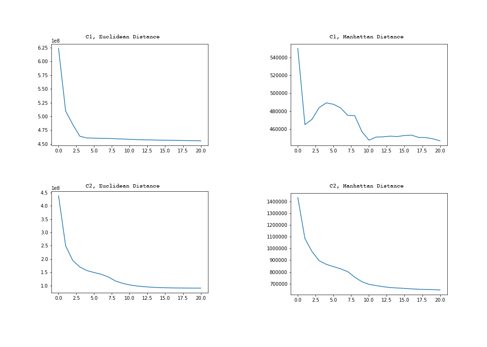

### K-means on Spark

Implement iterative k-means using Spark. Please use the dataset from data within the bundle for this problem.

1. [data.txt](data/data.txt) contains the dataset which has 4601 rows and 58 columns. Each row is a document represented as a 58 dimensional vector of features. Each component in the vector represents the importance of a word in the document.
2. [c1.txt](data/c1.txt) contains k initial cluster centroids. These centroids were chosen by selecting k = 10 random points from the input data.
3. [c2.txt](data/c2.txt) contains initial cluster centroids which are as far apart as possible. (You can do this by choosing 1st centroid c1 randomly, and then finding the point c2 that is farthest from c1, then selecting c3 which is farthest from c1 and c2, and so on).

Set number of iterations (MAX ITER) to 20 and number of clusters k to 10 for all the ex- periments carried out in this question. Your driver program should ensure that the correct amount of iterations are run.

#### Code
Jupyter notebook: [k_means.ipynb](k_means.ipynb)

Python script: [k_means.py](k_means.py)
```bash
../../bin/spark-submit k_means.py
```


